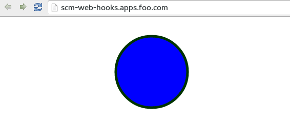
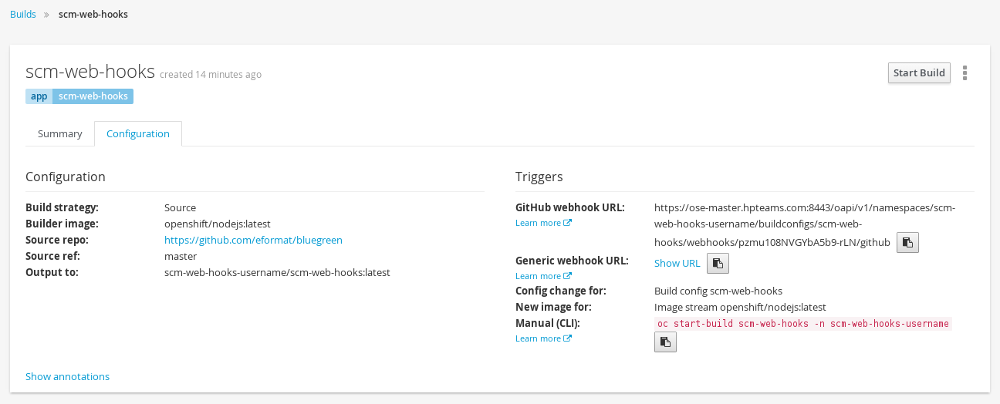

#**Lab 10: Web Hooks using Source Control Management**

OpenShift offers several mechanisms to trigger the automatic deployment of applications.

In this Lab, we will demonstrate the deployment of a very simple application via a GitHub Web Hook trigger.

## Part I

In Part I of the Lab we will:

1. Create a new project.
2. Deploy an application using a source to image strategy.
3. Create a route to expose the newly deployed application.

**Step 1: Create new project**

**Remember** to substitute the UserName

    $ oc new-project scm-web-hooks-username --display-name="Test WebHooks"

**Step 2: Create new application and expose a route**

Login to your github account - with your username. Fork the bluegreen repository from the previous lab

    https://github.com/eformat/bluegreen.git

**Remember** to substitute the UserName

    $ oc new-app --image-stream=nodejs --code=https://github.com/<Your Github User Name>/bluegreen.git#master --name=scm-web-hooks
    $ oc expose service scm-web-hooks --hostname=scm-web-hooks-username.apps.osecloud.com --name=scm-web-hooks

**Step 3: Look at the created resources**

Build configuration

    $ oc get bc

Deployment configuration

    $ oc get dc

Show created service

    $ oc get svc

Show replication controller

    $ oc get rc

Show route

    $ oc get route

Show the builds

    $ oc get builds
    NAME              TYPE      FROM         STATUS     STARTED         DURATION
    scm-web-hooks-1   Source    Git@master   Complete   4 minutes ago   32s

Monitor the build

    $ oc logs build/scm-web-hooks-1

The build should finish with a line similar to:

    I1118 21:08:23.073696       1 sti.go:233] Successfully pushed 172.30.234.236:5000/scm-web-hooks-username/scm-web-hooks:latest

**Step 4: Test the application**

Observe the route `oc get route` and past the host/port into the browser. You should see:

## Part II

At this point you have an application with one single replica running inside a docker container in OpenShift.

We used the source retrieved from the git repository and layered it using a builder or image stream strategy; in this particular case,
the nodejs image stream.

In this part of the Lab we will:

1. Configure a web hook for the recently deployed application.
2. Make a small change to the application.
3. Test to make sure the application was re-deployed.

**Step 1: Retrieve the OpenShift Web Hook URL**

- Navigate to the OpenShift Web console and login.
- Click on your project, browse and then builds. Select your build.
- Click on Show URL for the GitHub link.
- Copy and Paste the GitHub Web Hook URL.

**Step 2: Configure GitHub repository Web Hook**

- Login to your GitHub account.
- Navigate to the forked repository you used to create the application.
- Click on Settings.
- Click on Webhooks and Services
- Click on the "Add webhook" button.
- Add the recently copied Web Hook URL from OpenShift.
- Click on the "Disable SSL Verification" button.
- Confirm by adding the "Add Webhook" button in green at the bottom of the page.

**Step 3: Redeploy the application**

Edit in your GitHub account the `requestHandlers.js` file.

One of the lines in line 9 or 10 should be commented out. Make a change on line 24 to
show a different image color:

    'context.fillStyle = "green";'+

Commit the file.

**Step 4: Monitor new deployment process**

After saving/committing the image.php file with the small change, you'll notice
in the OpenShift Web Console that a new build process has been automatically 
triggered. **You didn't have to start a build yourself.**

Monitor the build process using:

    $ oc get builds
    $ oc logs build/<the-new-build-process-name>

**Step 5: Trigger a Build using the generic WebHook**

You can also trigger the generic web hook manually using curl. Copy the generic webhook thats
located right under the Gituhb webhook. You can issue a curl command to trigger a build as follows. **Remember to use your webook URI as the -k argument**

    $ curl -i -H "Accept: application/json" -H "X-HTTP-Method-Override: PUT" -X POST -k https://ose31-master.hosts.foo.com:8443/oapi/v1/namespaces/scm-web-hooks-username/buildconfigs/scm-web-hooks/webhooks/2fAh3WCY81LrHSC0Bcp3/generic

If successful, you should see a response similar to this:

    HTTP/1.1 200 OK
    Cache-Control: no-store
    Date: Thu, 19 Nov 2015 02:23:52 GMT
    Content-Length: 0
    Content-Type: text/plain; charset=utf-8

## Summary

We have shown in this Lab how simple it is to configure automatic deployments
of applications using OpenShift and GitHub Web Hook triggers as well as how to trigger Generic Web Hooks.
