#**Lab 15: Create build pipelines using Jenkins**

In this lab we are going to learn about pipeline integration with OpenShift.

We are going to run through a number of pipeline examples demonstrating common build and deployment techniques, including:

* Simple pipeline - the 'HelloWorld' example
* Blue-Green pipeline
* A/B pipeline 
* Multi-project pipeline

The multi-project example will focus on the build / tag / promote lifecycle using our CI/CD tooling - Jenkins.

**Prerequisites**

Your environment should be set up with these artifacts, but if not heres how to manually load them.

We will be using Jenkins image streams in our OpenShift environment:

    $ oc import-image --all --insecure=true --confirm -n openshift docker.io/openshift/jenkins-2-centos7
    $ oc import-image --all --insecure=true --confirm -n openshift registry.access.redhat.com/openshift3/jenkins-2-rhel7

Jenkins contains the followig necessary plugins:

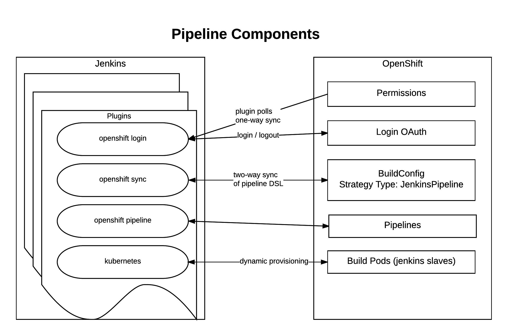

Load the following templates for Jenkins if they are not present in your OpenShift environment:

    $ oc create -f https://raw.githubusercontent.com/openshift/openshift-ansible/master/roles/openshift_examples/files/examples/v1.4/quickstart-templates/jenkins-ephemeral-template.json -n openshift
    $ oc create -f https://raw.githubusercontent.com/openshift/openshift-ansible/master/roles/openshift_examples/files/examples/v1.4/quickstart-templates/jenkins-persistent-template.json -n openshift

Load the sample application template as well:

    $ oc create -f https://raw.githubusercontent.com/openshift/origin/master/examples/jenkins/pipeline/samplepipeline.json -n openshift

The OpenShift cluster should be configured to automatically provision Jenkins by setting the following cluster wide configuration in "master-config.yaml"

    jenkinsPipelineConfig:
        autoProvisionEnabled: true
        parameters:
          JENKINS_IMAGE_STREAM_TAG: jenkins-2-rhel7:latest
          ENABLE_OAUTH: "true"
        serviceName: jenkins
        templateName: jenkins-persistent
        templateNamespace: openshift

The source code for these jenkins images is in [github](https://github.com/openshift/jenkins) and examples of its use
can be found [here](https://github.com/openshift/origin/tree/master/examples/jenkins) and [here](https://github.com/openshift/jenkins-plugin)
for the jenkins kubernetes plugin.

**Step 1 - Simple Pipeline**

Create a project named "samplepipeline-username"

**Remember** to substitute the username with your own id.

    $ oc new-project samplepipeline-username --display-name="Pipeline Sample" --description='Pipeline Sample'

We can then create our sample application from template:

    $ oc new-app jenkins-pipeline-example 

A mongodb and jenkins pod should be provisioned into your project. We can browse to the "Build", "Pipeline", "Configuration" and see the 
groovy DSL Jenkinsfile for this pipeline.

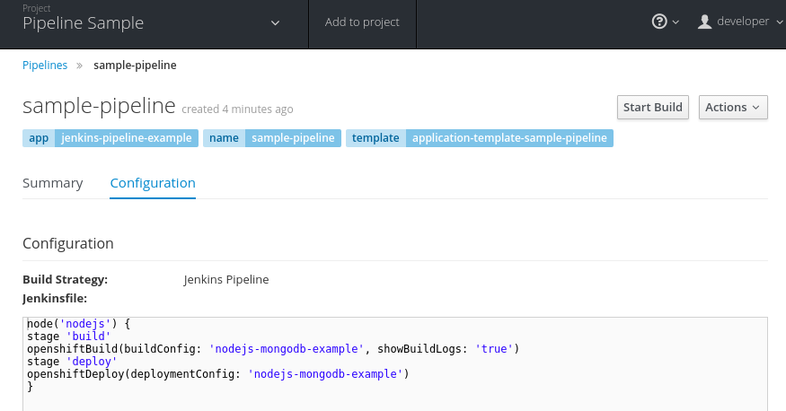

The "openshiftBuild" and "openshiftDeploy" method calls are from the Jenkins OpenShift Pipeline plugin.

Start the pipeline build from the web-ui by selecting "Start Build" or:

    $ oc start-build sample-pipeline

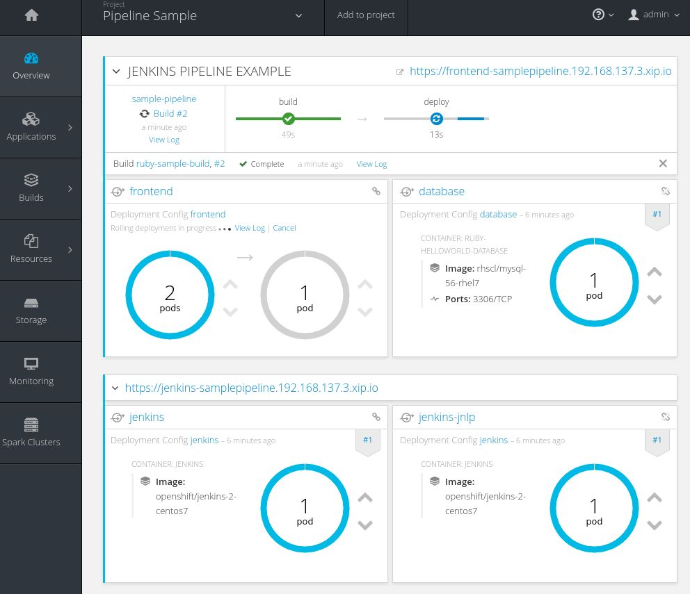

Note how the "node()" from the Jenkinsfile DSL is being run on a pod that starts a build pod for our application:

    $ oc get pods
    NAME                             READY     STATUS      RESTARTS   AGE
    jenkins-1-11fa6                  1/1       Running     0          9m
    mongodb-1-g84t4                  1/1       Running     0          9m
    nodejs-2fc075ffd1b7              1/1       Running     0          2m    <- node pod
    nodejs-mongodb-example-1-build   0/1       Completed   0          1m    <- build pod
    nodejs-mongodb-example-1-tfh02   1/1       Running     0          13s   <- running application

If you browse to the running applicaiton URL, you can see a simple page count that increments on every visit and is stored in the mongodb.

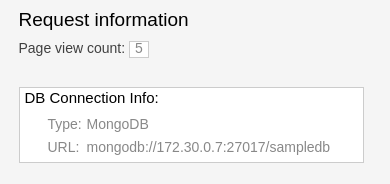

**(Optional) Accessing the Database**

We can connect to the mongodb to look at the generated data by doing:

    $ oc rsh $(oc get pods -l name=mongodb -o name)
    $ mongo -u admin -p <pwd> --authenticationDatabase admin
    > show databases
    > use sampledb
    > show collections
    > db.counts.find();

    { "_id" : ObjectId("58a4d26daf987c001805092f"), "ip" : "172.17.0.1", "date" : 1487196781386 }
    { "_id" : ObjectId("58a4d277af987c0018050930"), "ip" : "172.17.0.1", "date" : 1487196791551 }
    ...

This shows us the data is stored as one row per page hit per ip address.

**Step 2: Blue-Green Pipeline**

The blue-green deployment strategy minimizes the time it takes to perform a deployment cut-over by ensuring you
have two (or more) versions of your application stacks available during the deployment.

We can make use of the service and routing tiers
in OpenShift to easily switch between our two running application stacks - hence it is very simple and fast to perform a rollback.

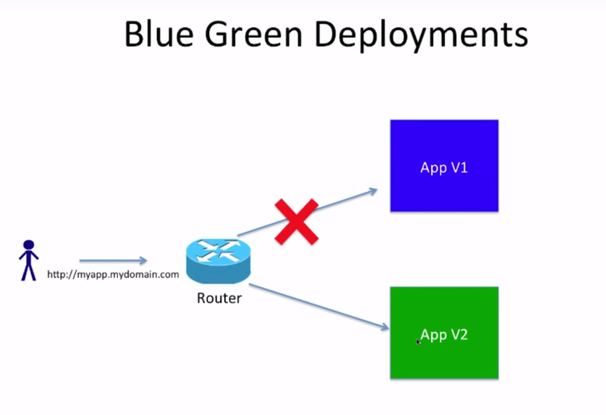

Let's create a new project:

**Remember** to substitute the username with your own id.

    $ oc new-project bluegreen-username --display-name="Blue Green Deployments" --description="Blue Green Deployments"

Lets deploy both our blue and green applications into the same project:

    $ oc new-app "https://github.com/devops-with-openshift/bluegreen#master" --name=blue
    $ oc new-app "https://github.com/devops-with-openshift/bluegreen#green" --name=green

We care going to expose services for our endpoints so we can test them independantly, and point the 'bluegreen' route to the blue service.

    $ oc expose service blue --name=bluegreen
    $ oc expose service blue --name=blue
    $ oc expose service green --name=green

Create the blue-green pipeline:

    $ oc create -f https://raw.githubusercontent.com/eformat/bluegreen/master/bluegreen-pipeline.yaml

Once the applications are built and deployed, you should be able to browse to the bluegreen service:

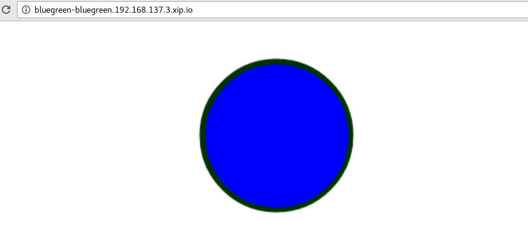

Now, it is possible to manually switch the routes via the web-ui or CLI:

    $ oc patch route/bluegreen -p '{"spec":{"to":{"name":"green"}}}'
    $ oc patch route/bluegreen -p '{"spec":{"to":{"name":"blue"}}}'

We have automated this switch into a Jenkisfile pipeliene as code. Start the pipeline build:

    $ oc start-build bluegreen-pipeline

Once the pod that runs the pipeline instruction starts, you should see the running pipeline:

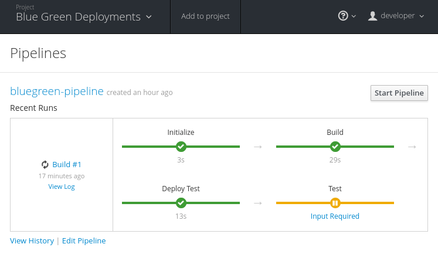

A new build and deployment of the 

There is a manual input task to approve switching the bluegreen route. Select 'Input Required' and login to Jenkins:

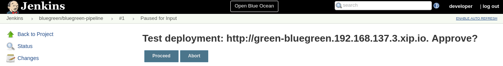

You can browse to the URL first to ensure this the desired 'green', select 'Proceed':

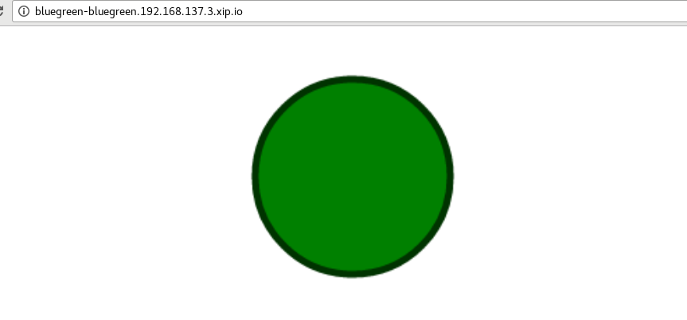

Once completed the 'bluegreen' route will show 'green' instead of 'blue'. You can shoose to 'Rollback' the change as well.

**(Optional) Configure a Webhook to call the pipeline**

Fork the github project using your user credentials:

    https://github.com/devops-with-openshift/bluegreen

In Github browse to Project -> Settings -> WebHooks -> Add WebHook

Enter the webhook cpoied from OpenShift -> Project -> Builds -> Pieplines -> blugreen-pipeline -> GitHub WebHook URL which looks like:

    Payload URL: https://<master api server>:8443/oapi/v1/namespaces/bluegreen-username/buildconfigs/bluegreen-pipeline/webhooks/<secret>/github

Patch the source references in your project to use your github fork:

    $ oc patch bc/blue -p '{"spec":{"source":{"git":{"uri":"https://github.com/<your username>/bluegreen.git","ref": "master"}}}}' --type=strategic -n bluegreen-username
    $ oc patch bc/green -p '{"spec":{"source":{"git":{"uri":"https://github.com/<your username>/bluegreen.git","ref": "green"}}}}' --type=strategic -n bluegreen-username

You can now make edits in GitHub and these will trigger a build of your OpenShift pipeline.

**Step 3: A/B Pipeline**

OpenShfit's exposes API's to manipulate the Routing tier. We can use this to create an A/B pipeline from our previous bluegreen example.

A/B deployments get their name from the ability to test the new application features as part of the deployment. This way you can create a hypothesis, perform an A/B
deployment, test whether your hypothesis is true or false and either rollback to your initial application state (A) or proceed with your new application state (B).

Let's create weighted route backends for our application. We need to change the default load balacing behaviour from 'least-connection' to 'round-robin'

    $ oc annotate route/bluegreen haproxy.router.openshift.io/balance=roundrobin
    $ oc set route-backends routes/bluegreen blue=100 green=0

Let's also create our ab-pipeline and start it from the CLI or web-ui:

    $ oc create -f https://raw.githubusercontent.com/eformat/bluegreen/master/ab-pipeline.yaml
    $ oc start-build ab-pipeline

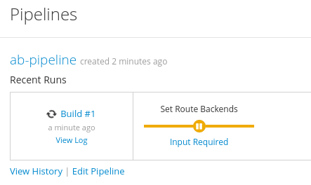

If we set the weights for our services:

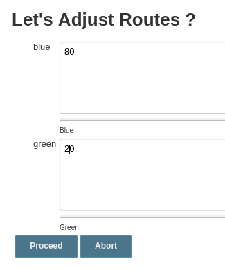

We can test that 80% of traffic is going to our 'A' (blue) version, and 20% is going to our 'B' (green) version:

**Remember** to substitute the username and hostname with your own id and environment URL:

    $ for x in {1..10}; do curl -s http://bluegreen-bluegreen-username.192.168.137.3.xip.io/ | grep -q blue && echo $x blue || echo $x green; done

    1 blue
    2 blue
    3 blue
    4 blue
    5 green
    6 blue
    7 blue
    8 blue
    9 blue
    10 green

Beacuase the default configuraiton for HAProxy is to honour sticky sessions using cookies, we can see this in a Broswer or from CLI (always get the same version):

    $ for x in {1..10}; do curl -c /tmp/cookie -b /tmp/cookie -s http://bluegreen-bluegreen-username.192.168.137.3.xip.io | grep -q blue && echo $x blue || echo $x green; done

    1 blue
    2 blue
    3 blue
    4 blue
    5 blue
    6 blue
    7 blue
    8 blue
    9 blue
    10 blue

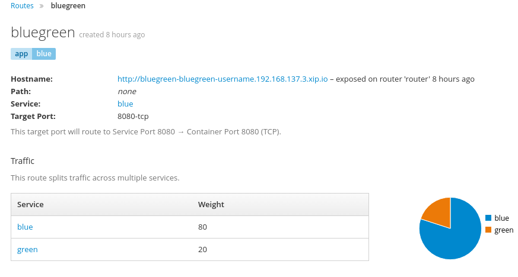

**Step 4: Multi Project Pipeline**

Ideally we want to build our immutable application images once then tag the images for promotion into other projects - to perform our pipeline activities such as testing
and eventually production deployment. The feedback from our various activities forms the gates for downstream activities. The basics of build, tag and promote forms
the foundation for every container based application to flow through our delivery lifecycle.

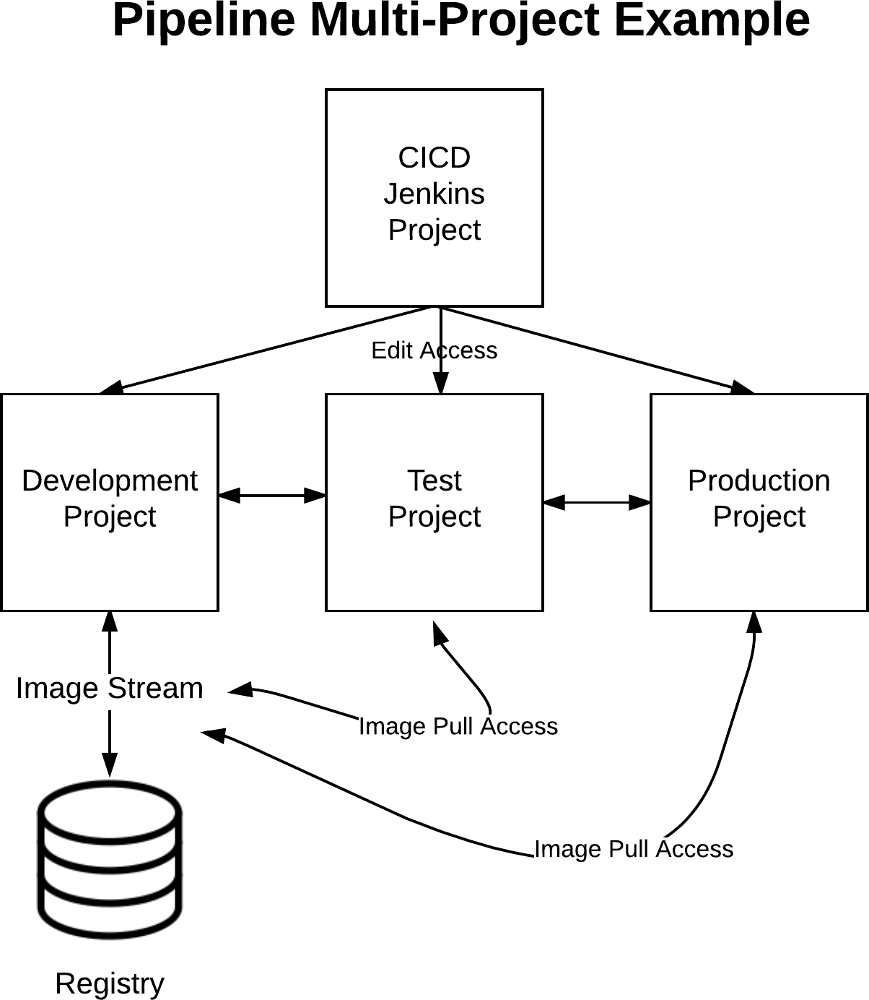

We are going to setup four projects for our pipeline activities:

**Remember** to substitute the username with your own id

* cicd-username - containing our Jenkins instance
* development-username - for building and developing our application images 
* testing-username - for testing our application
* production-username - hosting our production application

Create the projects:

    $ oc new-project cicd-username --display-name='CICD Jenkins' --description='CICD Jenkins'
    $ oc new-project development-username --display-name='MyApp Development' --description='MyApp Development'
    $ oc new-project testing-username --display-name='MyApp Testing' --description='MyApp Testing'
    $ oc new-project production-username --display-name='MyApp Production' --description='MyApp Production'

Provide the jenkins service account in the cicd project access to our other projects:

    $ oc policy add-role-to-user edit system:serviceaccount:cicd-username:jenkins -n development-username
    $ oc policy add-role-to-user edit system:serviceaccount:cicd-username:jenkins -n testing-username
    $ oc policy add-role-to-user edit system:serviceaccount:cicd-username:jenkins -n production-username

Allow the testing and production service accounts to pull images from the development namespace:

    $ oc policy add-role-to-group system:image-puller system:serviceaccounts:testing-username -n development-username
    $ oc policy add-role-to-group system:image-puller system:serviceaccounts:production-username -n development-username

Your shuold now have these projects:

We can deploy our Jenkins container now:

    $ oc new-app -n cicd-username --template=jenkins-persistent -p JENKINS_IMAGE_STREAM_TAG=jenkins-2-centos7:latest,NAMESPACE=openshift,MEMORY_LIMIT=2048Mi,ENABLE_OAUTH=true

And create the pipeline:

    $ oc create -n cicd-username -f https://raw.githubusercontent.com/eformat/pipeline-configs/master/pipeline.yaml

Lets create our development application using Source to Image.

**Remember** to substitute the username with your own id and hostname with the correct hostname for your environment:

    $ oc project development-username
    $ oc new-app openshift/php:5.6~https://github.com/devops-with-openshift/cotd.git#master --name=myapp
    $ oc expose service myapp --hostname=cotd-development-username.192.168.137.3.xip.io --name=myapp

Lets setup our testing project, using the image from development and changing the image pull policy to always.

**Remember** to substitute the username with your own id and hostname with the correct hostname for your environment and Be sure to use your own
environment registry ip address (from 'oc get is')

    $ oc project testing-username
    $ oc create dc myapp --image=172.30.18.201:5000/development-username/myapp:promoteQA
    $ oc deploy myapp --cancel
    $ oc patch dc/myapp -p '{"spec":{"template":{"spec":{"containers":[{"name":"default-container","imagePullPolicy":"Always"}]}}}}'
    $ oc deploy myapp --cancel -n testing-username
    $ oc expose dc myapp --port=8080
    $ oc expose service myapp --hostname=cotd-testing-username.192.168.137.3.xip.io --name=myapp

We are using the arbitrary :promoteQA image tag for the testing deployment (which doesn't yet exist)

We can do the same setup for the production project using the promotePRD image tag:

    $ oc project production-username
    $ oc create dc myapp --image=172.30.18.201:5000/development-username/myapp:promotePRD
    $ oc deploy myapp --cancel
    $ oc patch dc/myapp -p '{"spec":{"template":{"spec":{"containers":[{"name":"default-container","imagePullPolicy":"Always"}]}}}}'
    $ oc deploy myapp --cancel
    $ oc expose dc myapp --port=8080
    $ oc expose service myapp --hostname=cotd-production-username.192.168.137.3.xip.io --name=myapp

Now we are ready to run our pipeline deployment from the cicd-username project.

    $ oc start-build pipeline -n cicd-username

The first step will log you in to Jennkins via OAuth and query you for your project paramterised username

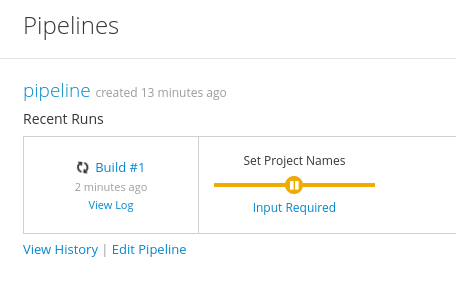

Once the image is built and deployed in development, it is tagged 'promoteQA' and deployed into the testing project.

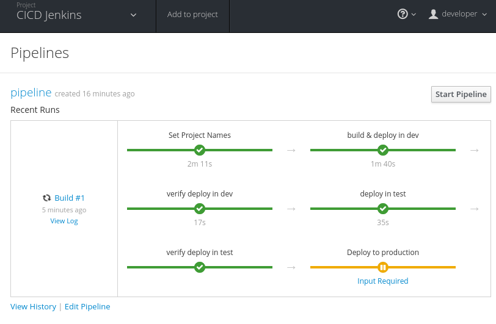

You can test the application, and them manually approve the image tagging/promotion to the production project.

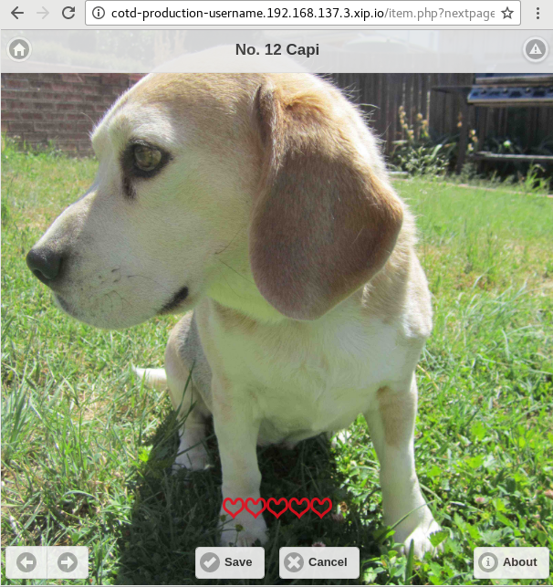

##Summary##

You have successfully:

- created and deployed the hello world integrted pipeline sample
- used BlueGreen, A/B deployment strategies using integrated pipelines
- deployed and configured a multi-project pipeline example that demonstrates a build, tag and promote lifecycle 
