#**Lab 25: Apache Spark, Zeppelin on OpenShift**

This lab sets up the following components for large scale data processing on OpenShift:

- [Apache Spark](http://spark.apache.org/) is a fast and general engine for large-scale data processing.
- [Apache Zeppelin](https://zeppelin.incubator.apache.org/) is a web-based notebook that enables interactive data analytics. You can make beautiful data-driven, interactive and collaborative documents with SQL, Scala and more.

We will then create a few tests to try it out.

**Sources**

The Docker images are heavily based on [these images](https://github.com/mattf/docker-spark) that are curated in the upstream [Kubernetes examples](https://github.com/kubernetes/application-images/tree/master/spark) and the configuration adapted for OpenShift.

**Step 1 - Create Project**

Create a project using CLI or using the Web Console

    $ oc new-project spark-cluster-username --display-name="Apache Spark Cluster" --description='Apache Spark Cluster'

**Remember** to substitute the username.

The spark apache images need to run as root. A `cluster admin` can add the project's `default` user to the `anyuid` security constraint class:

**This needs to be done foreach project by a cluster admin**

    $ oc project spark-cluster-username
    $ oadm policy add-scc-to-user anyuid -z default

**Step 2: Create the Spark master service**

You will setup a Spark master service and a set of Spark workers using Spark's [standalone mode](http://spark.apache.org/docs/latest/spark-standalone.html)

Use the following command to create a replication controller running the Spark Master service:

    $ oc create -f https://raw.githubusercontent.com/eformat/kubernetes-spark/master/spark-master-controller.yaml

Now we need to create the service definition to create a logical service endpoint that Spark workers can use to access the Master pod.

    $ oc create -f https://raw.githubusercontent.com/eformat/kubernetes-spark/master/spark-master-service.yaml

You can then create a service for the Spark Master WebUI:

    $ oc create -f https://raw.githubusercontent.com/eformat/kubernetes-spark/master/spark-webui.yaml

We can expose this service externally using a route (remember to substitute the hostname for your environment):

    $ oc expose service spark-webui --hostname=spark-webui-usarname.apps.osecloud.com

We can check to see if the master spark service is running:

    $ oc get pods
    NAME                            READY     STATUS    RESTARTS   AGE
    spark-master-controller-1hwpr   1/1       Running   0          3m

And we can browse to the spark WebUI

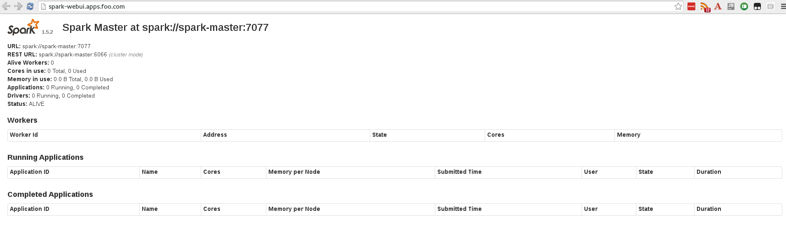

**Step 3 - Create the Spark workers**

The Spark workers do the heavy lifting in a Spark cluster. They provide execution resources and data cache capabilities for your program.

    $ oc create -f https://raw.githubusercontent.com/eformat/kubernetes-spark/master/spark-worker-controller.yaml

You should see two slave worker pods spin up:

    $ oc get pods
    NAME                            READY     STATUS    RESTARTS   AGE
    spark-master-controller-1hwpr   1/1       Running   0          14m
    spark-worker-controller-721ki   1/1       Running   0          8s
    spark-worker-controller-tthez   1/1       Running   0          8s

If you refresh the spark WebUI, these should appear:

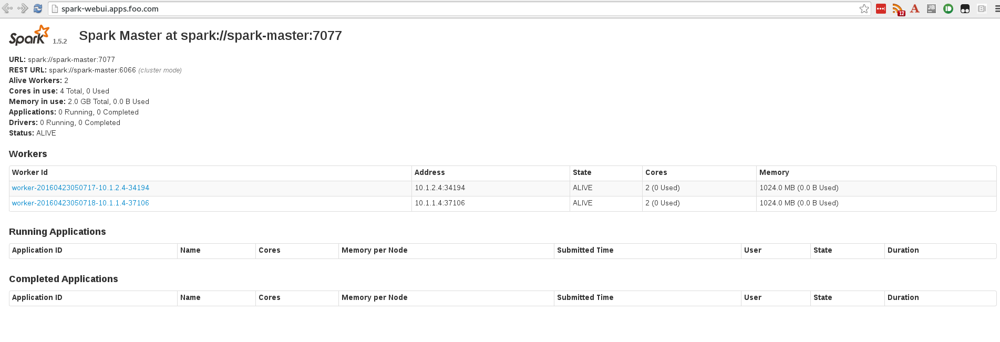

**Step 4 - Create the Zeppelin Pod and UI**

The Zeppelin UI pod can be used to launch jobs into the Spark cluster either via a web notebook frontend or the traditional Spark command line.

See [Zeppelin](https://zeppelin.incubator.apache.org/) and [Spark Architecture](https://spark.apache.org/docs/latest/cluster-overview.html) for more details.

    $ oc create -f https://raw.githubusercontent.com/eformat/kubernetes-spark/master/zeppelin-controller.yaml

And now create a service to expose the Zeppelin WebUI:

    $ oc create -f https://raw.githubusercontent.com/eformat/kubernetes-spark/master/zeppelin-service.yaml

We can expose this service externally using a route (remember to substitute the hostname for your environment):

    $ oc expose service zeppelin --hostname=zeppelin-username.apps.osecloud.com

You should now see a zeppelin pod:

    $ oc get pods
    NAME                            READY     STATUS    RESTARTS   AGE
    spark-master-controller-1hwpr   1/1       Running   0          27m
    spark-worker-controller-721ki   1/1       Running   0          12m
    spark-worker-controller-tthez   1/1       Running   0          12m
    zeppelin-controller-swar8       1/1       Running   0          1m

You can also browse to the WebUI:

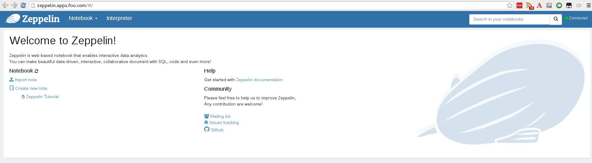

**Step 5 - Data Science Examples**

Lets try out a couple of big data analytics examples. These form part of the Zeppelin tutorials.

You create a dataset from external data, then apply parallel operations to it. The building block of the Spark API is its RDD API.

In the RDD API, there are two types of operations: transformations, which define a new dataset based on previous ones, and actions, which kick off a job to execute on a cluster.

On top of Spark’s RDD API, high level APIs are provided, e.g. DataFrame API and Machine Learning API. These high level APIs provide a concise way to conduct certain data operations.

## Shakespeare

Lets do some simple word counting using spark and one of its language binding - python.

Create a Zeppelin note called `Shakespeare`

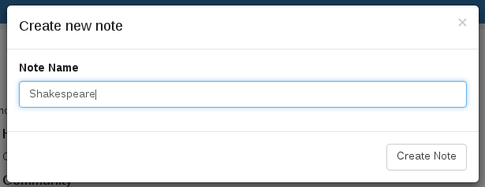

Lets start by counting the words in Hamlet. Enter the following paragraph:

    %pyspark
    import urllib2
    hamlet = urllib2.urlopen('https://raw.githubusercontent.com/eformat/kubernetes-spark/master/data/shakespeare/hamlet.txt').read()
    rdd = sc.parallelize([hamlet])
    print rdd.map(lambda s: len(s.split())).sum()

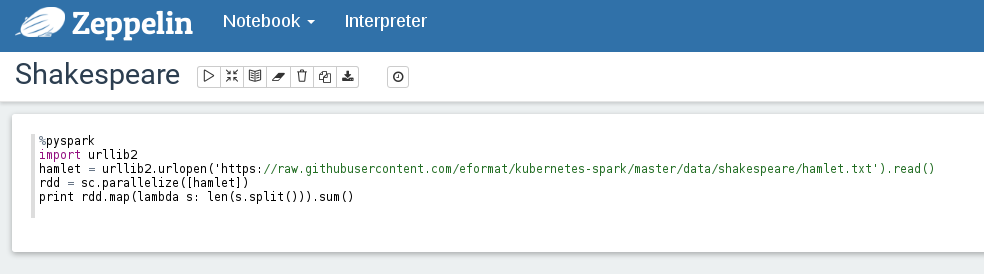

We can execute this by selecting `Shift-Enter` or clicking on the run triangle button in the top right.

We should see after the job has run, the word count

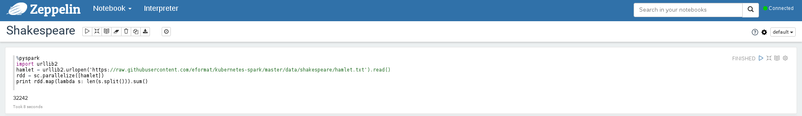

We can also count from two of Shakespeare's text using sparks context in a new paragraph

    %pyspark
    import urllib2
    hamlet = urllib2.urlopen('https://raw.githubusercontent.com/eformat/kubernetes-spark/master/data/shakespeare/hamlet.txt').read()
    othello = urllib2.urlopen('https://raw.githubusercontent.com/eformat/kubernetes-spark/master/data/shakespeare/othello.txt').read()
    rdd_two = sc.parallelize([hamlet,othello])
    print rdd_two.map(lambda s: len(s.split())).sum()

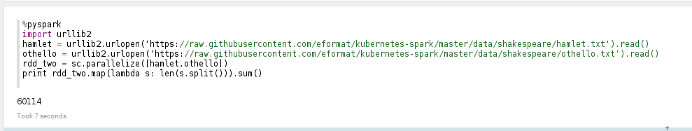

Lets try counting all the words in Shakespeares texts - enter a new paragraph

    %pyspark
    import urllib2
    all = urllib2.urlopen('https://raw.githubusercontent.com/eformat/kubernetes-spark/master/data/shakespeare/all.txt').read()
    rdd_all = sc.parallelize([all])
    print rdd_all.map(lambda s: len(s.split())).sum()

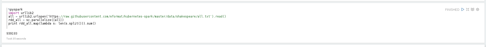

## Banking

Create a Zeppelin note called `Banking`

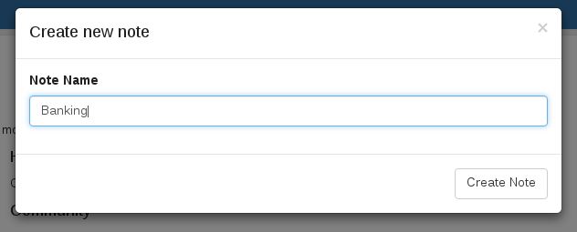

Copy the following code into the note. This loads some data from an amazon S3 bucket and creates a spark RDD and DataFrame.

    import org.apache.commons.io.IOUtils
    import java.net.URL
    import java.nio.charset.Charset

    // Zeppelin creates and injects sc (SparkContext) and sqlContext (HiveContext or SqlContext)
    // So you don't need create them manually

    // load bank data
    val bankText = sc.parallelize(
        IOUtils.toString(
            new URL("https://s3.amazonaws.com/apache-zeppelin/tutorial/bank/bank.csv"),
            Charset.forName("utf8")).split("\n"))

    case class Bank(age: Integer, job: String, marital: String, education: String, balance: Integer)

    val bank = bankText.map(s => s.split(";")).filter(s => s(0) != "\"age\"").map(
        s => Bank(s(0).toInt,
                s(1).replaceAll("\"", ""),
                s(2).replaceAll("\"", ""),
                s(3).replaceAll("\"", ""),
                s(5).replaceAll("\"", "").toInt
            )
    ).toDF()
    bank.registerTempTable("bank")

Select `Shift-Enter` or the `Run this paragraph` triangle in the top right to execute this code.

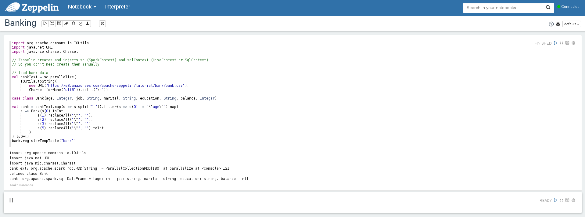

We can now run a query against our cached DataFrame.

Enter the following piece of SQL into a new paragraph and execute it:

    %sql
    select age, count(1) value
    from bank
    where marital="${marital=single,single|divorced|married}"
    group by age
    order by age

This will use Zeppelin's built-in visualization - which is the simplest, most common way to visualize a data graph.

You can select the type of graph, and select to display marital status as well.

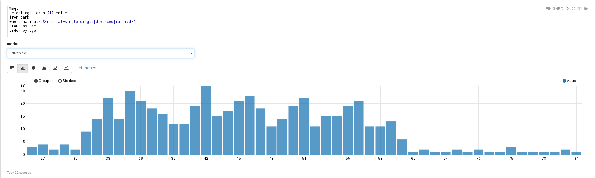

**(Optional) Further extensions**

Here are some further ideas and extensions to this Lab:

- [Gluster storage](https://github.com/eformat/kubernetes/tree/master/examples/spark/spark-gluster) - this guide is an extension of the
standard Spark on Kubernetes Guide and describes how to run Spark on GlusterFS using the Kubernetes Volume Plugin for GlusterFS.
- Hadoop & Hortonworks - the base google images used on this Lab can be updated and extended to include HDFS and Hadoop file system support.
There are more example [Zeppelin Notebooks](https://github.com/hortonworks-gallery/zeppelin-notebooks) from Hortonworks that require hadoop support to function.

##Summary##

Congratulations ! You have successfully:

- built and deployed an apache Spark cluster and Zeppelin big data analytics platform on OpenShift
- tested some example big data applications using data pipelines and sparkql
