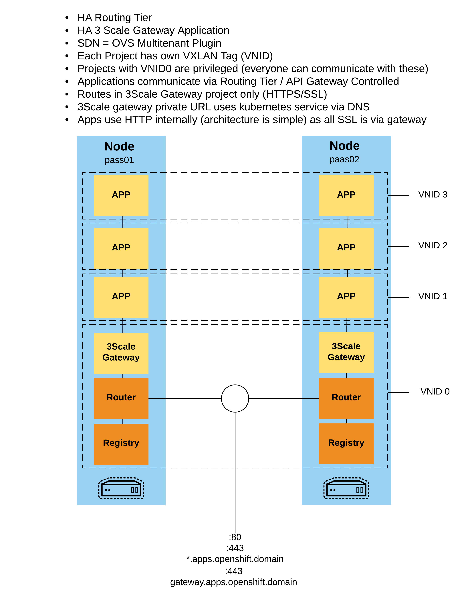
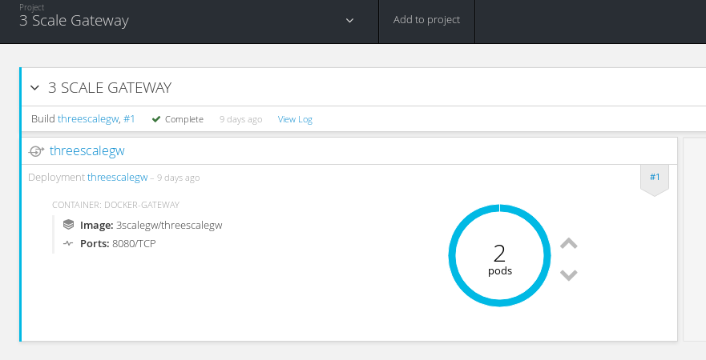
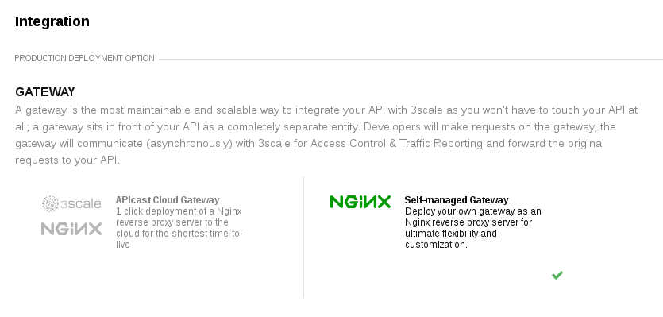
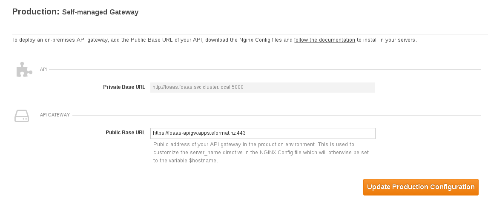
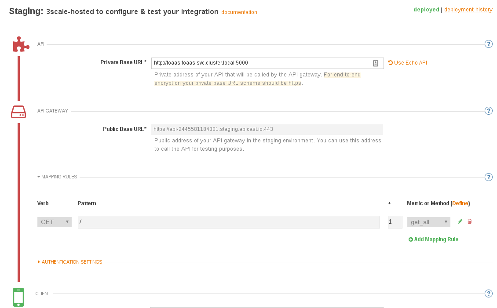
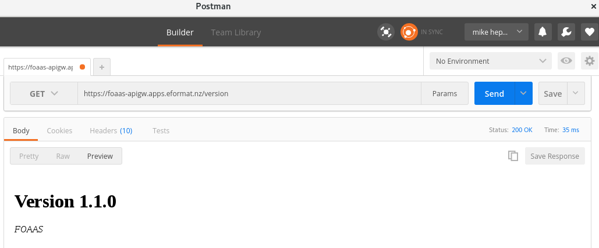

#**Lab 27: Build a Secure API using 3Scale and Openshift**

In this lab we will will learn how to deploy a 3Scale gateway architecture into a network isolated version of Openshift.

This has the following benefits:

- have network isolation between application projects
- external api and routes are deployed into the 3scale gateway project (VNID0)
- application / microservices are not exposed externally with any routes
- the 3scale gateway can talk directly to the kubernetes clustered ip/service endpoint (shortcutting routing tier)
- authentication and ssl termination are handled at the routing tier and api gateway
- simplified architecture (can have non ssl service api's within openshift and ssl externally) 

**Prerequisites**

* A working OpenShift 3.3+ environment you have `cluster-admin` and `developer` based access
* 3scale account and login
* To support OVS Multitenancy, you cannot use minishift, oc cluster up, or other developer type versions 
  of Openshift.

**Architecture**

**Step 1: Configure the OVS Multitenant SDN Plugin**

If you have a default install of Openshift, the Openshift SDN plugin is likely configured using default `openshift-ovs-subnet` setting.
In your ansible host file (advanced install) we need to set this to use `openshift-ovs-multitenant`

    # Configure the multi-tenant SDN plugin (default is 'redhat/openshift-ovs-subnet')
    os_sdn_network_plugin_name='redhat/openshift-ovs-multitenant'
    #os_sdn_network_plugin_name='redhat/openshift-ovs-subnet'

If Openshift is already installed, you can retroactively enable this by following the [documentation here](https://docs.openshift.com/container-platform/3.3/install_config/configuring_sdn.html#configuring-the-pod-network-on-masters)

Basically, edit all of these files on master and nodes:

    /etc/origin/master/master-config.yaml 
    /etc/origin/node/node-config.yaml 

And set:

    networkPluginName: "redhat/openshift-ovs-multitenant" 

Then restart the master and node services:

    systemctl restart atomic-openshift-master
    systemctl restart atomic-openshift-node

You will *also* need to restart all of your applications (as pods only correctly get assigned VXLAN tags on startup). You may find it easier to restart
all of your servers.

Once Openshift is back up and running, you can test the change has applied OK:

    oc get clusternetworks

    NAME      NETWORK       HOST SUBNET LENGTH   SERVICE NETWORK   PLUGIN NAME
    default   10.1.0.0/16   8                    172.30.0.0/16     redhat/openshift-ovs-multitenant

Your projects are now network isolated from each other - [read here for details](https://docs.openshift.com/container-platform/3.3/architecture/additional_concepts/sdn.html)

**Step 2: Install 3Scale Gateway on Openshift**

The [official documentation](https://support.3scale.net/guides/infrastructure/docker-openshift) for Openshift docker based installation.

Short cut steps are to deploy using the [Openshift 3Scale Template](https://raw.githubusercontent.com/3scale/docker-gateway/master/3scale-gateway-openshift-template.yml)

    oc new-project "3scalegw" --display-name="3 Scale Gateway" --description="3 Scale Gateway"
    oc create -f https://raw.githubusercontent.com/3scale/docker-gateway/master/3scale-gateway-openshift-template.yml -n openshift
    oc new-app --template=openshift/3scale-gateway -p THREESCALE_ADMIN_URL=<your 3scale user admin URL>,THREESCALE_PROVIDER_KEY=<your 3scale provider key>
    oc expose svc/threescalegw --hostname=apigw.apps.<your openshift domain>

Once deployed you should see two nginx pods up and running in your `3scalegw` project:

We need to add an externally visible Route for our application (which we will create next) that is exposed via the API Gateway. We will set `edge` termination for our
TLS scheme - i.e. use the default SSL certificate of the HAProxy Routers:

    oc expose svc threescalegw --hostname=foaas-apigw.apps.<your domain> --name=foaas-apigw
    oc patch route/foaas-apigw -p '{"spec":{"tls":{"termination":"edge"}}}'

We can add multiple routes for multiple API's controlled by our gateway if you have a 3Scale Enterprise account. So the traffic call chain will look like this

    Client <-> HAProxy Router's <-> 3Scale GW's <-> Kube Service <-> Application POD's

**Step 3: Install Test Application**

Any API application will suffice - in this example we are going to deploy a node.js HTTP/REST based API that is stateless. You will have to forgive the example, i
was having a bad day!

    oc new-project foaas
    oc new-app nodejs:4~https://github.com/eformat/foaas
    oc scale dc/fooas --replicas=2
    oc delete svc foaas
    oc expose dc foaas --port=5000

We won't expose a Route for the application service running on port 5000, we want that internal to our setup. But if you need to test without the API gateway, feel free to expose a Route:

    oc expose svc foaas

**Step 4: Set API Gateway project to be global**

Now, because we are using OVS in multitenant mode, all of our projects are given unique VXLAN ID's (VNID) so that when traffic is tagged by the ovs switch - we get network isolation per project/namespace.

We can see the network VNID's by running this command:

    oc get netnamespace

    NAME               NETID
    3scalegw           3589645
    default            0
    foaas              1146103

The Router and Registry are deployed into the `default` namespace that has VNID0 - all other projects can communicate to/from VNID0 i.e. it is global.
Lets also make our 3Ccale gateway project global so that our application `foass` project can communicate with it (but not other projects not in VNID0)

    oc adm pod-network make-projects-global 3scalegw

And now:

    oc get netnamespace

    NAME               NETID
    3scalegw           0
    default            0
    foaas              1146103

Here is the [documentation](https://docs.openshift.com/container-platform/3.3/admin_guide/managing_pods.html) for this command.

You may test that the `foaas` project is indeed network isolated by trying to tcp connect / curl from another project's pod. This will fail.

**Step 4: Configure 3Scale API**

Login to the 3scale admin portal. Setup an NGINX `Self-managed Gateway` using [these instructions](https://support.3scale.net/docs/deployment-options/nginx-gateway)

Browse to API -> Integration in the admin portal. We want to set our `Private Base Url` for our API to use the kubernetes cluster service name for our API:

    Private Base URL: http://foaas.foaas.svc.cluster.local:5000
    Public Base URL: https://foaas-apigw.apps.eformat.nz:443

The cloud Hosted `Staging` environment links in the 3scale admin portal will not work - as we are referencing the API using the private kubernetes svc that
is only available from withing Openshift (and can be seen by the API Gateway).

We have configured a simple application with a single `GET /` method for this lab - of course in a production deployment we would have multiple URI's
 and/or applications mapped here. With an Enterprise 3Scale account you may even have multiple integration gateways configured (e.g. one for internal, one for external API traffic)

Select the `Update & Test Staging Configuration` button

Select the `Update Production Configuraiton` button.

To deploy to our hosted gateway configuraiton from the cloud, restart the pods in our `3scalegw` project:

    oc delete pods $(oc get pods -n 3scalegw | grep ^threescalegw | awk '{print $1}')

You do not have to download and reconfigure Nginx manually.

**Step 5: Test**

We should be good to test our application. Try using the CLI or web-ui such as `Postman`

    curl -k "https://foaas-apigw.apps.eformat.nz/version" -H'user_key: <the correct api key from 3scale>'
    <!DOCTYPE html> <html> <head> <title>FOAAS - Version 1.1.0 - FOAAS</title> <meta charset="utf-8"> <meta property="og:description" content="Version 1.1.0 FOAAS">
    ...

Note: If you are using the default authntication with 3Scale - `Authenticated by API key`, you need the API Key to correctly call the API. This is
availabe in the amdin web-ui in the integration settings page. If you use the wrong API key / authentication you will get a `HTTP/1.1 403 Forbidden` response:

    curl -k "https://foaas-apigw.apps.eformat.nz/off/noel/mike" -H'user_key: wrong-key'
    Authentication failed

##Summary##

Congratulations ! You have successfully:

* deployed the 3Scale API Gateway onto Openshift
* used Openshift's multi-tenant networking plugin to isolate traffic between projects
* exposed an API via 3Scale using SSL and API Key authentication

- TODO - entperise - multiple apps, multiple gateways, router sharding, OAuth integration using SSO.

