#**Lab 28: Take Fuse Integration Services 2.0 for a test drive**

In this lab we will will learn how to deploy the Fuse Integration Service 2.0 demos on Openshift

You too can become and integration ninja !!

FIS contains tools and containerized xPaaS images that enable development, deployment, and management of
 integration microservices within OpenShift

It has the following supported workflows

* S2I source workflow
* S2I binary workflow

And supported images

* Spring Boot container image - Camel 2.18, Spring Boot 1.4.1
* Karaf container image - Camel 2.17 (same version as JBoss Fuse 6.3)

With the STI source workflow, you pass the URL to your git repo to the example application templates which then use
the supported images below to build and deploy your application.

With the STI binary workflow, you build the application on OpenShift passing the local files as a binary build and deploy
using the fabric8 maven plugin target https://maven.fabric8.io/

    mvn fabric8:deploy

Both methods are demonstrated in the examples, although most use the S2I source workflow and templates. If you prefer to
 use the STI binary workflow, git clone the source code as specified in the GIT_REPO parameters passed to the templates
 in the examples and use the fabric8 maven target instead.

The examples in the Workshop include:

Application | Description | Link
------------ | ------------- | -----
JBoss Forge | Using forge to build maven archetypes | [link](#head2)
karaf2-camel-amq | Order Routing by Country via AMQ and camel | [link](#head3)
karaf2-camel-log | Hello World camel route, log to sysout | [link](#head4)
karaf2-camel-rest-sql | Books and Orders using MySQL and camel routes | [link](#head5)
karaf2-cxf-rest | CRUD customers using CXF | [link](#head6)
springboot-camel-amq | Order Routing by Country via AMQ and camel | [link](#head7)
springboot-camel-brms | Spring Boot application with a remote Kie Server | [link](#head8)
springboot-camel-jdg | Idempotent message consumer using JDG cache | [link](#head9)
springboot-camel-rest-sql | Books and Orders using MySQL and camel routes | [link](#head10)
springboot-camel | Hello World camel route, log to sysout | [link](#head11)
springboot-camel-xml | Camel routes in Spring Boot via a Spring XML | [link](#head12)
springboot-cxf-jaxrs | HelloWorld Spring Boot CXF RS (REST) | [link](#head13)
springboot-cxf-jaxws | HelloWorld Spring Boot CXF WS (Soap) | [link](#head14)
springboot-camel-jdv | Spring Boot application with a remote virtual db | [link](#head15)

**Prerequisites**

* A working OpenShift 3.3+ environment you have `cluster-admin` and `developer` based access
* maven 3.3 and java 1.8 installed on your laptop

We are going to deploy a nexus container with a persistent volume claim to cache the maven dependencies required to
build the examples. This speeds builds up first time builds dramatically - note that the examples have *incremental: true* set 
in the build configurations - so will remount the previous build container and .m2 dependencies to also speed up builds. Using nexus
also saves your bandwidth !

    oc new-project nexus --display-name="Nexus" --description="Nexus"
    oc project nexus
    oc new-app -f https://raw.githubusercontent.com/eformat/openshift-nexus/master/nexus.yaml

Once the nexus pod has deployed install the following repositories as *admin/admin123* user:

Repo Name | URL | Type
--------- | --- | -------------
jboss-ga | http://maven.repository.redhat.com/techpreview/all | Release
fusesource.m2 | https://repo.fusesource.com/nexus/content/groups/public | Release
repository.jboss.org | http://repository.jboss.org/nexus/content/groups/public | Mixed
fusesource.ea | https://repo.fusesource.com/nexus/content/groups/ea | Release
redhat.ga | https://maven.repository.redhat.com/ga | Release
redhat-early-access | https://maven.repository.redhat.com/earlyaccess/all | Mixed

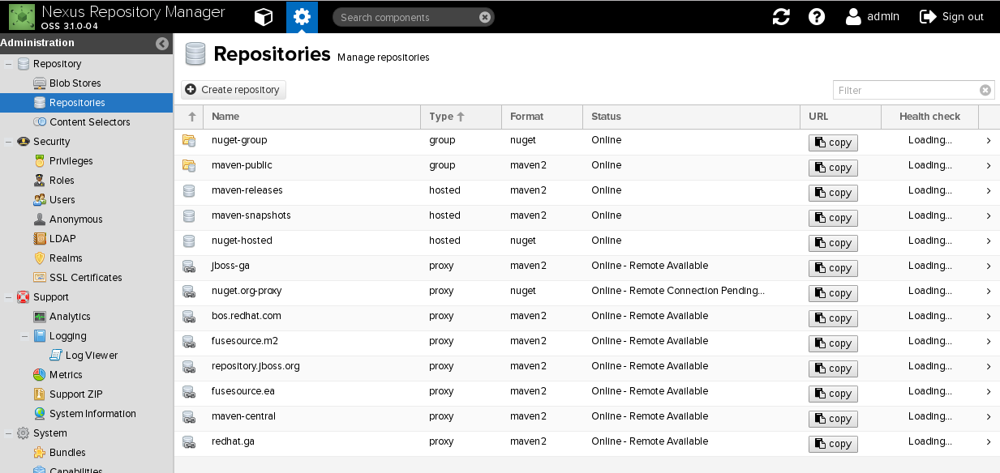

Once addded, make sure to expose these in the `maven-public` member repo's list as well.

The examples contain an override maven settings file that points to this nexus repo. There is no need to set a 'repositories' element
in the pom.xml

    configuration/settings.xml

You may wish to add these repo's to your local ~/.m2/settings.xml if you wish to build and deploy from the CLI using fabric8 maven plugin https://maven.fabric8.io/

**Step 1: Import Image Streams and Templates and Setup Forge**

`Note: these instructions are for the Tech Preview Release, so need  slight modification when GA release hit public repos`

Import image streams into your Openshift cluster as a cluster admin:

    // Choose a version !
    BASEURL=https://raw.githubusercontent.com/jboss-fuse/application-templates/GA
    BASEURL=https://raw.githubusercontent.com/jboss-fuse/application-templates/master

    oc replace --force -n openshift -f ${BASEURL}/fis-image-streams.json

For the JDV, JDG and BRMS example, Import and Tag the images streams if you don't have them already:

    oc import-image --insecure=true -n openshift registry.access.redhat.com/jboss-datagrid-6/datagrid65-openshift --confirm
    oc import-image --insecure=true -n openshift registry.access.redhat.com/jboss-datavirt-6/datavirt63-openshift --confirm
    oc import-image --insecure=true -n openshift registry.access.redhat.com/jboss-decisionserver-6/decisionserver63-openshift --confirm        
    oc tag --insecure=true --source=docker registry.access.redhat.com/jboss-datagrid-6/datagrid65-openshift:latest openshift/jboss-datagrid65-openshift:latest
    oc tag --insecure=true --source=docker registry.access.redhat.com/jboss-datagrid-6/datagrid65-openshift:latest openshift/jboss-datagrid65-openshift:latest
    oc tag --insecure=true --source=docker registry.access.redhat.com/jboss-decisionserver-6/decisionserver63-openshift openshift/jboss-decisionserver63-openshift:latest

Import the application example templates if you do not have them already:

    // if using MASTER
    oc replace --force -n openshift -f ${BASEURL}/quickstarts/karaf2-camel-amq-template.json
    oc replace --force -n openshift -f ${BASEURL}/quickstarts/karaf2-camel-log-template.json
    oc replace --force -n openshift -f ${BASEURL}/quickstarts/karaf2-camel-rest-sql-template.json
    oc replace --force -n openshift -f ${BASEURL}/quickstarts/karaf2-cxf-rest-template.json
    oc replace --force -n openshift -f ${BASEURL}/quickstarts/springboot-camel-amq-template.json
    oc replace --force -n openshift -f ${BASEURL}/quickstarts/springboot-camel-brms-template.json
    oc replace --force -n openshift -f ${BASEURL}/quickstarts/springboot-camel-jdg-template.json
    oc replace --force -n openshift -f ${BASEURL}/quickstarts/springboot-camel-jdv-template.json
    oc replace --force -n openshift -f ${BASEURL}/quickstarts/springboot-camel-rest-sql-template.json
    oc replace --force -n openshift -f ${BASEURL}/quickstarts/springboot-camel-template.json
    oc replace --force -n openshift -f ${BASEURL}/quickstarts/springboot-camel-xml-template.json
    oc replace --force -n openshift -f ${BASEURL}/quickstarts/springboot-cxf-jaxrs-template.json
    oc replace --force -n openshift -f ${BASEURL}/quickstarts/springboot-cxf-jaxws-template.json

    // if using GA
    oc replace --force -n openshift -f ${BASEURL}/quickstarts/karaf2-camel-amq-template.json
    oc replace --force -n openshift -f ${BASEURL}/quickstarts/karaf2-camel-log-template.json
    oc replace --force -n openshift -f ${BASEURL}/quickstarts/karaf2-camel-rest-sql-template.json
    oc replace --force -n openshift -f ${BASEURL}/quickstarts/karaf2-cxf-rest-template.json
    oc replace --force -n openshift -f ${BASEURL}/quickstarts/spring-boot-camel-template.json
    oc replace --force -n openshift -f ${BASEURL}/quickstarts/spring-boot-camel-amq-template.json
    oc replace --force -n openshift -f ${BASEURL}/quickstarts/spring-boot-camel-config-template.json
    oc replace --force -n openshift -f ${BASEURL}/quickstarts/spring-boot-camel-drools-template.json
    oc replace --force -n openshift -f ${BASEURL}/quickstarts/spring-boot-camel-infinispan-template.json
    oc replace --force -n openshift -f ${BASEURL}/quickstarts/spring-boot-camel-rest-sql-template.json
    oc replace --force -n openshift -f ${BASEURL}/quickstarts/spring-boot-camel-teiid-template.json
    oc replace --force -n openshift -f ${BASEURL}/quickstarts/spring-boot-camel-xml-template.json
    oc replace --force -n openshift -f ${BASEURL}/quickstarts/spring-boot-cxf-jaxrs-template.json
    oc replace --force -n openshift -f ${BASEURL}/quickstarts/spring-boot-cxf-jaxws-template.json

The example source code is forked from the following two repositories, the main changes include adding nexus configuration settings: 

    https://github.com/jboss-openshift/openshift-quickstarts
    https://github.com/fabric8-quickstarts

Install JBoss Forge if you haven't done this already - http://forge.jboss.org/download

    curl http://forge.jboss.org/sh | sh

Install the Fuse Addon:

    $ forge
      addon-install --coordinate org.jboss.fuse.forge.addon:fuse-forge,1.0.1

**Step 2: SpringBoot example using Forge to scaffold code**

Lets build a springboot example just maven archetype and forge to scaffold out code:

    mkdir -p ~/git/sandbox && cd ~/git/sandbox
    forge

Create the project:

    project-new --type fuse --named my-spring-boot    
    // use the following options
    0  // springboot
    1  // springboot camel example
    CTRL-D // exit

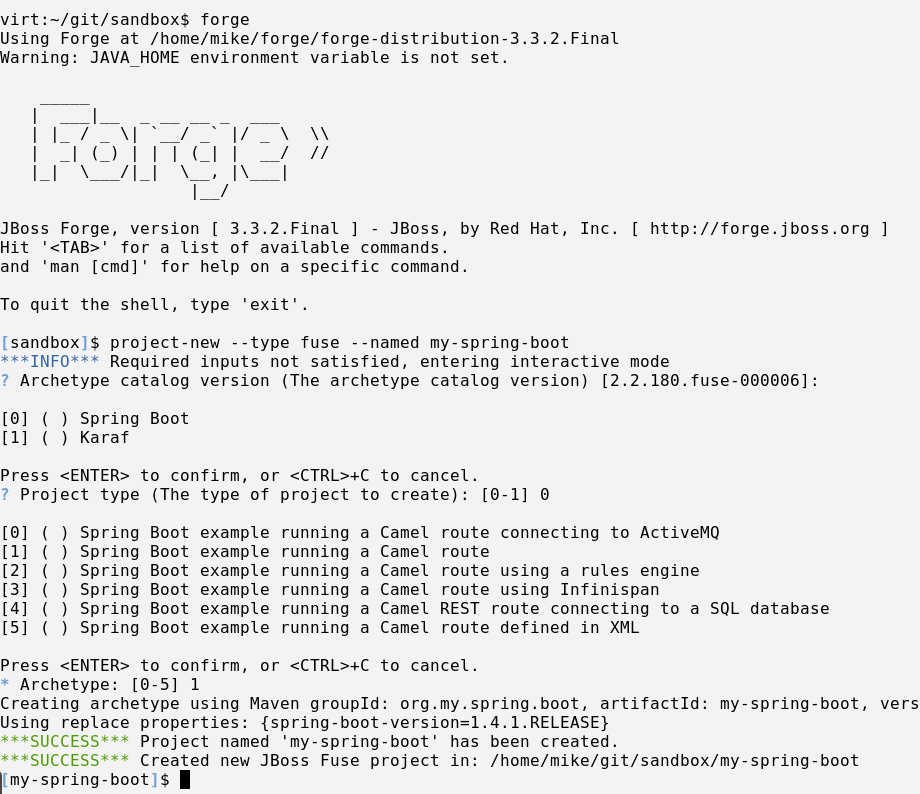

Install into Openshift:

    oc login -u developer --server=https://192.168.137.3:8443 --insecure-skip-tls-verify=true -p developer
    oc new-project my-spring-boot 
    cd ~/git/sandbox/my-spring-boot
    mvn fabric8:deploy

This will build and deploy the application using the Binary S2I workflow orchestrated by the fabric8 maven plugin

The build should complete within OpenShift and a pod spun up. If you check the pods running logs you will see the
output of the camel route:

    oc logs my-spring-boot-1-l5s29

    19:12:01.240 [Camel (MyCamel) thread #0 - timer://foo] INFO  route1 - >>> Hello World
    19:12:06.237 [Camel (MyCamel) thread #0 - timer://foo] INFO  route1 - >>> Hello World
    19:12:11.237 [Camel (MyCamel) thread #0 - timer://foo] INFO  route1 - >>> Hello World

If you browse to the pod in the OpenShift web ui, you should see the `Open Java Console` link. Click this and the
`hawt.io` console will open up. Select the `Route Diagram` to see the HelloWorld camel route

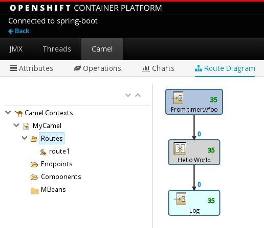

**Step 3: karaf2-camel-amq example**

Camel in a Karaf Container using Blueprint to connect to the A-MQ xPaaS message broker

    oc new-project karaf2-camel-amq --display-name="karaf2-camel-amq" --description="karaf2-camel-amq"
    oc new-app --template=amq62-basic -p MQ_USERNAME=admin -p MQ_PASSWORD=admin
    oc new-app --template=s2i-karaf2-camel-amq -p GIT_REPO="https://github.com/eformat/karaf2-camel-amq" -p GIT_REF="" -p ACTIVEMQ_USERNAME=admin -p ACTIVEMQ_PASSWORD=admin

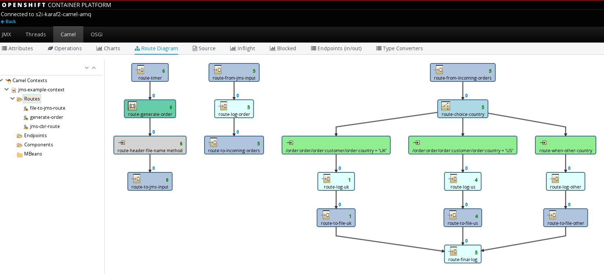

**Step 4: karaf2-camel-log example**

HelloWorld logging example in karaf using camel

    oc new-project karaf2-camel-log --display-name="karaf2-camel-log" --description="karaf2-camel-log"
    oc new-app --template=s2i-karaf2-camel-log -p GIT_REPO="https://github.com/eformat/karaf2-camel-log" -p GIT_REF=""

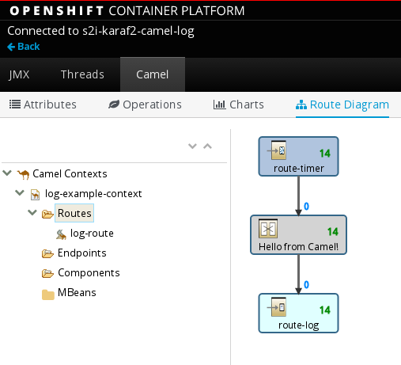

**Step 5: karaf2-camel-rest-sql example**

Book & Order example using REST, MYSQL RDBMS and camel

    oc new-project karaf2-camel-rest-sql --display-name="karaf2-camel-rest-sql" --description="karaf2-camel-rest-sql"
    oc new-app --template=mysql-persistent -p MYSQL_USER="dbuser" -p MYSQL_PASSWORD="password" -p MYSQL_DATABASE="sampledb"
    oc new-app --template=s2i-karaf2-camel-rest-sql -p GIT_REPO="https://github.com/eformat/karaf2-camel-rest-sql" -p GIT_REF="" -p MYSQL_SERVICE_USERNAME="dbuser" -p MYSQL_SERVICE_PASSWORD="password"

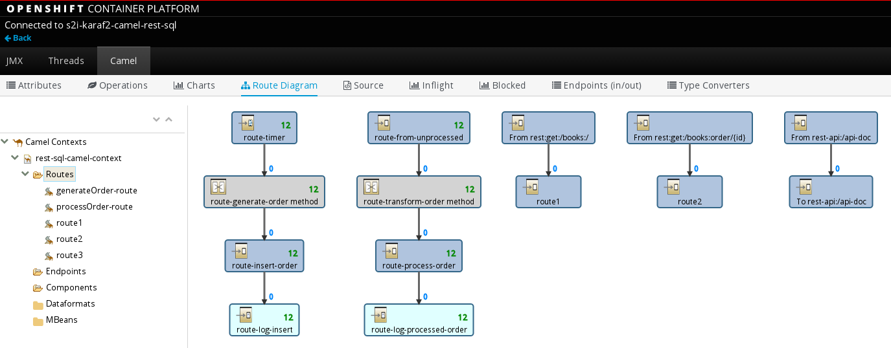

Testing:

    // login to database
    oc rsh $(oc get pods -lapp=mysql-persistent --template='{{range .items}}{{.metadata.name}}{{end}}')
    mysql -u $MYSQL_USER -p$MYSQL_PASSWORD -h $HOSTNAME $MYSQL_DATABASE
    show databases;
    use sampledb;
    show tables;
    select * from orders;

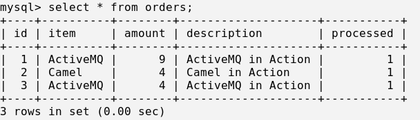

    // Show swagger doc and expose service (only required for testing purposes)
    oc expose dc s2i-karaf2-camel-rest-sql --port=8181 --generator=service/v1
    oc expose svc s2i-karaf2-camel-rest-sq

    // browse to api-doc
    http://s2i-karaf2-camel-rest-sq-karaf2-camel-rest-sql.192.168.137.3.xip.io/camel-rest-sql/api-doc

    // exposed services for testing
    camel-rest-sql/books
    camel-rest-sql/books/order/{id}

    // Test services
    curl http://s2i-karaf2-camel-rest-sq-karaf2-camel-rest-sql.192.168.137.3.xip.io/camel-rest-sql/books/order/3 | jq
    curl http://s2i-karaf2-camel-rest-sq-karaf2-camel-rest-sql.192.168.137.3.xip.io/camel-rest-sql/books | jq

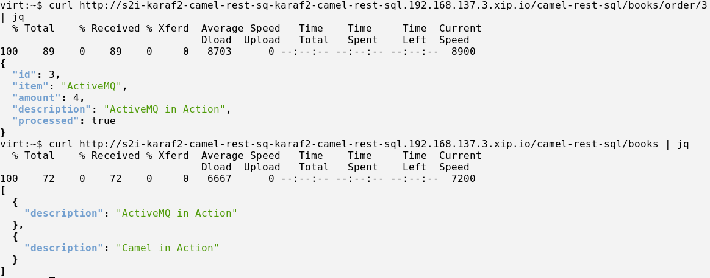

**Step 6: karaf2-cxf-rest example**

Customer service CRUD REST example using karaf and camel

    oc new-project karaf2-cxf-rest --display-name="karaf2-cxf-rest" --description="karaf2-cxf-rest"
    oc new-app --template=s2i-karaf2-cxf-rest -p GIT_REPO="https://github.com/eformat/karaf2-cxf-rest" -p GIT_REF=""

Testing:

    // swagger services
    http://s2i-karaf2-cxf-rest-route-karaf2-cxf-rest.192.168.137.3.xip.io/cxf/crm/swagger.json

    BASEURL=http://s2i-karaf2-cxf-rest-route-karaf2-cxf-rest.192.168.137.3.xip.io

    // clone code
    git clone git@github.com:eformat/karaf2-cxf-rest.git

    // Create a customer 
    curl -X POST -T src/test/resources/add_customer.xml -H "Content-Type: application/xml" ${BASEURL}/cxf/crm/customerservice/customers

    // Retrieve the customer instance with id 124
    curl ${BASEURL}/cxf/crm/customerservice/customers/124

    // Update the customer instance with id 124
    curl -X PUT -T src/test/resources/update_customer.xml -H "Content-Type: application/xml" ${BASEURL}/cxf/crm/customerservice/customers

    // Delete the customer instance with id 124
    curl -X DELETE ${BASEURL}/cxf/crm/customerservice/customers/124

**Step 7: springboot-camel-amq example**

Camel in a SpringBoot Container connecting to the A-MQ xPaaS message broker

    oc new-project spring-boot-camel-amq --display-name="spring-boot-camel-amq" --description="spring-boot-camel-amq"
    oc new-app --template=amq62-basic -p MQ_USERNAME=admin -p MQ_PASSWORD=admin
    oc new-app --template=s2i-springboot-camel-amq -p GIT_REPO="https://github.com/eformat/spring-boot-camel-amq" -p GIT_REF="" -p ACTIVEMQ_BROKER_USERNAME=admin -p ACTIVEMQ_BROKER_PASSWORD=admin

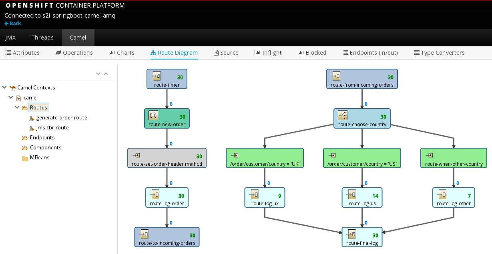

**Step 8: springboot-camel-brms example**

Camel in a SpringBoot Container connecting to BRMS

    oc new-project springboot-camel-brms --display-name="springboot-camel-brms" --description="springboot-camel-brms"
    
    // Note: STI source build has class loading error - FIXME
    //oc new-app --template=decisionserver63-https-s2i -p KIE_SERVER_USER=kieserver -p KIE_SERVER_PASSWORD=password -p SOURCE_REPOSITORY_URL=https://github.com/eformat/spring-boot-camel-drools.git -p SOURCE_REPOSITORY_REF=master -p CONTEXT_DIR=""

    // STI binary build works OK
    git clone git@github.com:eformat/spring-boot-camel-drools.git
    cd spring-boot-camel-drools
    mvn fabric8:deploy

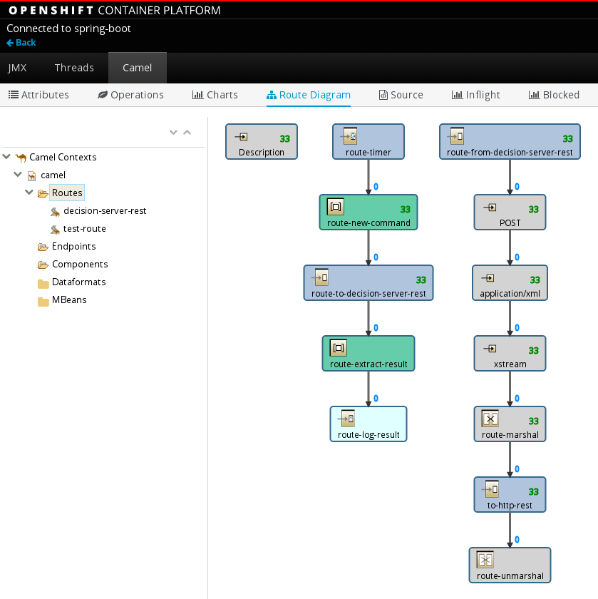

**Step 9: springboot-camel-jdg example**

Camel in a SpringBoot Container connecting to DataGrid, showing the idempotent consumer pattern and cache hit/miss

    oc new-project spring-boot-camel-infinispan --display-name="spring-boot-camel-infinispan" --description="spring-boot-camel-infinispan"
    oc new-app --template=datagrid65-basic
    // enable clustering if we scale up JDG
    oc policy add-role-to-user view system:serviceaccount:$(oc project -q):default -n $(oc project -q)
    oc new-app --template=s2i-springboot-camel-jdg -p GIT_REPO="https://github.com/eformat/spring-boot-camel-infinispan" -p GIT_REF=""

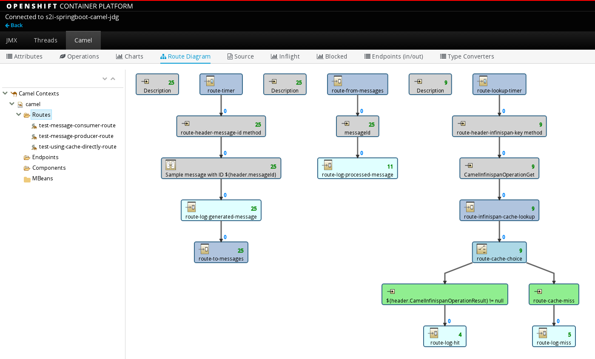

**Step 10: springboot-camel-rest-sql example**

Camel in a SpringBoot Container being called from a REST endpoint, storing Orders in a MYSQL RDBMS

    oc new-project spring-camel-rest-sql --display-name="spring-camel-rest-sql" --description="spring-camel-rest-sql"
    oc new-app --template=mysql-persistent -p MYSQL_USER="dbuser" -p MYSQL_PASSWORD="password",MYSQL_DATABASE="sampledb"
    oc new-app --template=s2i-springboot-camel-rest-sql -p GIT_REPO="https://github.com/eformat/spring-boot-camel-rest-sql" -p GIT_REF="" -p MYSQL_SERVICE_USERNAME="dbuser" -p MYSQL_SERVICE_PASSWORD="password"

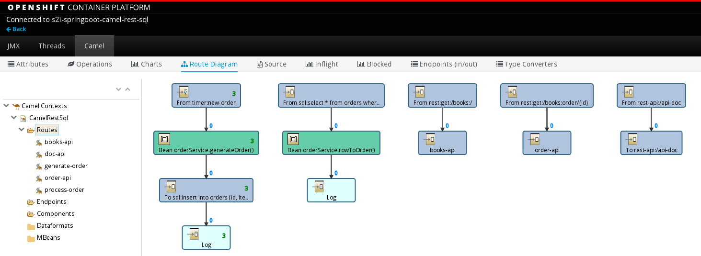

Testing:

    // login to database
    oc rsh $(oc get pods -lapp=mysql-persistent --template='{{range .items}}{{.metadata.name}}{{end}}')
    mysql -u $MYSQL_USER -p$MYSQL_PASSWORD -h $HOSTNAME $MYSQL_DATABASE
    show databases;
    use sampledb;
    show tables;
    select * from orders;

    oc expose dc s2i-springboot-camel-rest-sql --port=8080 --generator=service/v1
    oc expose svc s2i-springboot-camel-res

    curl s2i-springboot-camel-res-spring-camel-rest-sql.192.168.137.3.xip.io/camel-rest-sql/books/order/3 | jq
    curl s2i-springboot-camel-res-spring-camel-rest-sql.192.168.137.3.xip.io/camel-rest-sql/books | jq

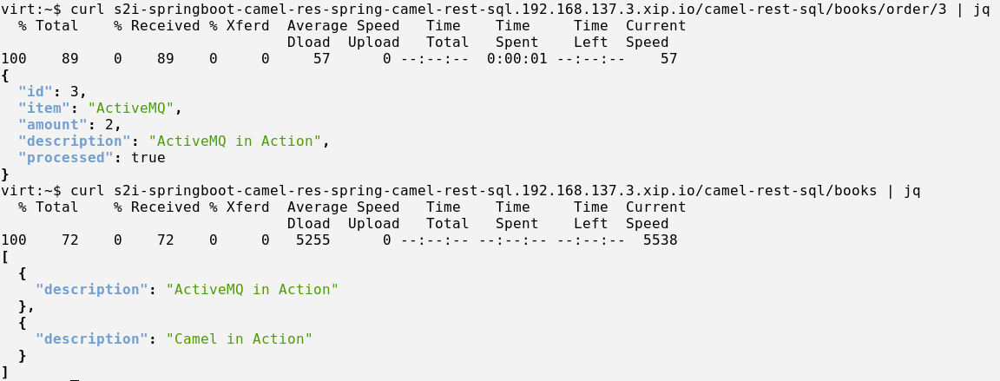

**Step 11: spring-boot-camel example**

Camel in a SpringBoot Container, HelloWorld logging to STOUT configured using Java DSL

    oc new-project spring-boot-camel --display-name="spring-boot-camel" --description="spring-boot-camel"
    oc new-app --template=s2i-springboot-camel -p GIT_REPO="https://github.com/eformat/spring-boot-camel.git" -p GIT_REF=""

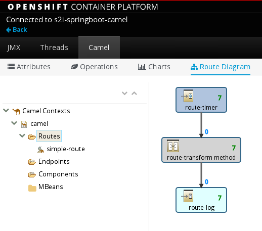

**Step 12: springboot-camel-xml example**

Camel in a SpringBoot Container, HelloWorld logging to STOUT configured using XML

    oc new-project spring-boot-camel-xml --display-name="spring-boot-camel-xml" --description="spring-boot-camel-xml"
    oc new-app --template=s2i-springboot-camel -p GIT_REPO="https://github.com/eformat/spring-boot-camel-xml.git" -p GIT_REF=""

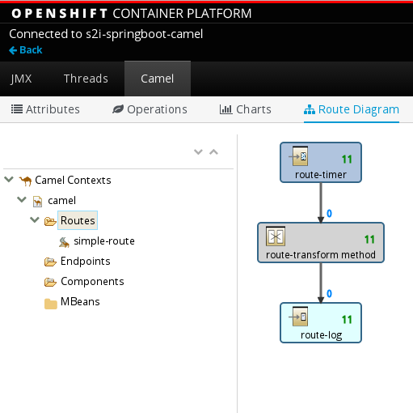

**Step 13: springboot-cxf-jaxrs example**

Camel in a SpringBoot Container, HelloWorld called via REST, called using REST JAXRS

    oc new-project spring-boot-cxf-jaxrs --display-name="spring-boot-cxf-jaxrs" --description="spring-boot-cxf-jaxrs"
    oc new-app --template=s2i-springboot-camel -p GIT_REPO="https://github.com/eformat/spring-boot-cxf-jaxrs.git" -p GIT_REF=""

    oc expose dc s2i-springboot-camel --port=8080 --generator=service/v1
    oc expose svc s2i-springboot-camel

Testing:

    curl http://s2i-springboot-camel-spring-boot-cxf-jaxrs.192.168.137.3.xip.io/services/helloservice/sayHello/mike

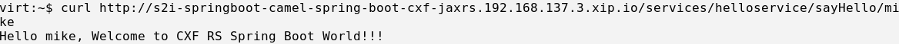    

**Step 14: springboot-cxf-jaxws example**

Camel in a SpringBoot Container, HelloWorld called via REST, called using Soap JAXWS

    oc new-project spring-boot-cxf-jaxws --display-name="spring-boot-cxf-jaxws" --description="spring-boot-cxf-jaxws"
    oc new-app --template=s2i-springboot-cxf-jaxws -p GIT_REPO="https://github.com/eformat/spring-boot-cxf-jaxws.git" -p GIT_REF=""

    oc expose dc s2i-springboot-cxf-jaxws --port=8080 --generator=service/v1
    oc expose svc s2i-springboot-cxf-jaxws

Testing:
 
    // Soap-UI
    http://s2i-springboot-cxf-jaxws-spring-boot-cxf-jaxws.192.168.137.3.xip.io/service/hello?wsdl

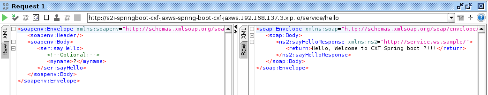

**Step 15: spring-boot-camel-teiid example**

Camel in a SpringBoot Container, connecting to Data Virtualization (teeid/JDV) using H2 DB and MYSQL DB

    oc create -n openshift -f https://raw.githubusercontent.com/jboss-openshift/application-templates/master/datavirt/datavirt63-basic-s2i.json
    oc create -n openshift -f https://raw.githubusercontent.com/jboss-openshift/application-templates/master/datavirt/datavirt63-secure-s2i.json
    oc create -n openshift -f https://raw.githubusercontent.com/jboss-openshift/application-templates/master/datavirt/datavirt63-extensions-support-s2i.json

    oc new-project spring-boot-camel-teiid --display-name="spring-boot-camel-teiid" --description="spring-boot-camel-teiid"

    oc new-app --template=datavirt63-basic-s2i -p SOURCE_REPOSITORY_URL=https://github.com/eformat/openshift-quickstarts -p SOURCE_REPOSITORY_REF=master -p CONTEXT_DIR=datavirt/dynamicvdb-datafederation/app -p TEIID_USERNAME=teiidUser -p TEIID_PASSWORD='p@ssw0rd1'
    oc create serviceaccount datavirt-service-account
    oc policy add-role-to-user view system:serviceaccount:$(oc project -q):datavirt-service-account
    oc secrets new datavirt-app-config /home/mike/git/openshift-quickstarts/datavirt/dynamicvdb-datafederation/datasources.env
    oc secrets link datavirt-service-account datavirt-app-config

    oc new-app --template=s2i-springboot-camel-jdv -p GIT_REPO="https://github.com/eformat/spring-boot-camel-teiid.git" -p GIT_REF="" -p TEIID_USERNAME=teiidUser -p TEIID_PASSWORD='p@ssw0rd1'

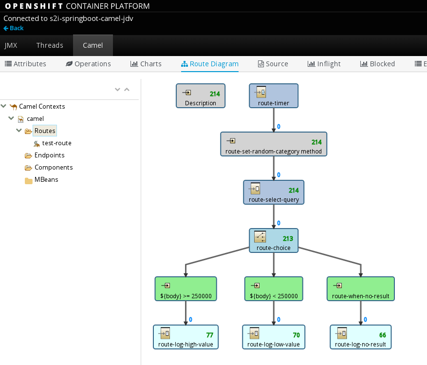

    // try out other DB backends
    // mysql5
    oc new-app --template=mysql-persistent -p DATABASE_SERVICE_NAME=accounts-mysql5 -p MYSQL_USER="myuser" -p MYSQL_PASSWORD="mypass" -p MYSQL_DATABASE="accounts"

    //
    // load schema & data once database running
    //
    cat /home/mike/git/openshift-quickstarts/datavirt/dynamicvdb-datafederation/mysql/customer-schema.sql |  oc exec $(oc get pods -lapp=mysql-persistent --template='{{range .items}}{{.metadata.name}}{{end}}') -i -- scl enable rh-mysql56 -- mysql -u '$MYSQL_USER' '-p$MYSQL_PASSWORD' -h '$HOSTNAME' accounts

    // check
    oc rsh $(oc get pods -lapp=mysql-persistent --template='{{range .items}}{{.metadata.name}}{{end}}')
    mysql -u $MYSQL_USER -p$MYSQL_PASSWORD -h $HOSTNAME $MYSQL_DATABASE
    show databases;
    use accounts;
    show tables;
    select * from PRODUCT;

    // Re-deploy SpringBoot container to configure against MYSQL DB
    oc env dc/datavirt-app QS_DB_TYPE=mysql5

##Summary##

Congratulations ! You have successfully:

* deployed all of the Fuse Integration Services 2.0 examples onto Openshift
* demonstrated integrations applications using Karaf, SpringBoot and Camel integration libraries 
* demonstrated using integrations with JBoss xPaaS images

