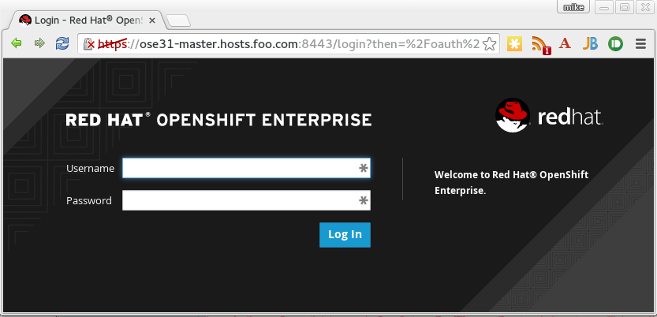
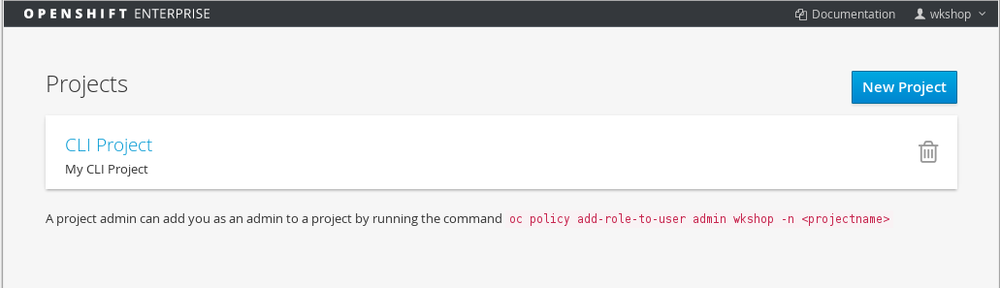
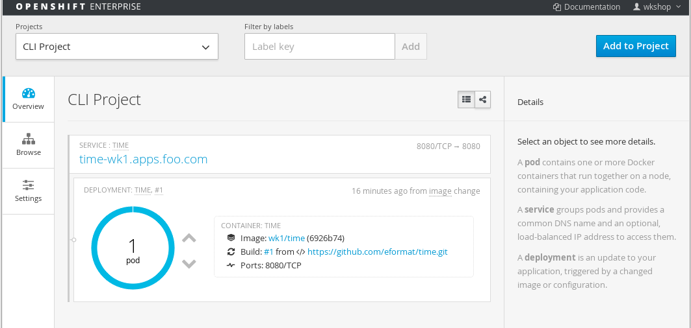
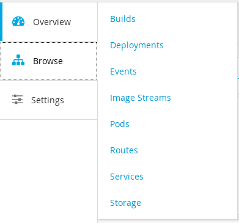
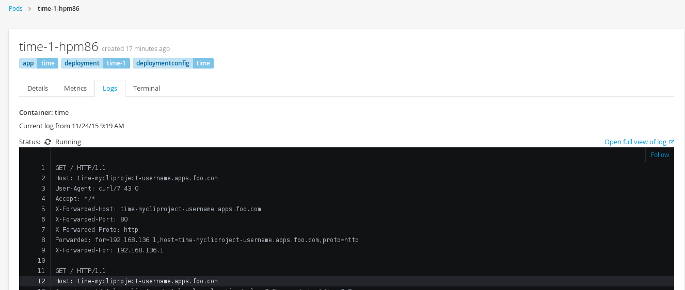
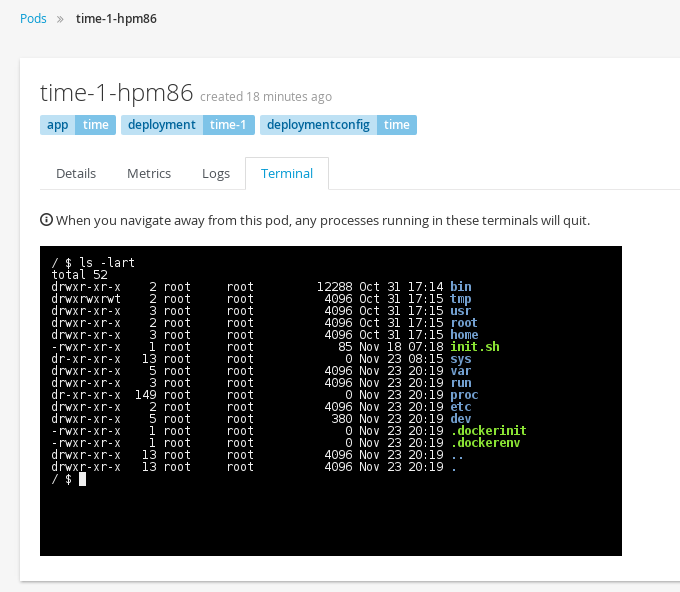
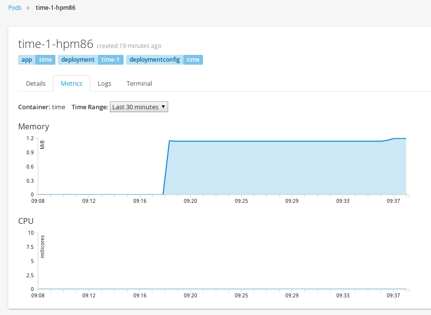
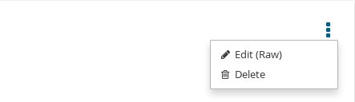
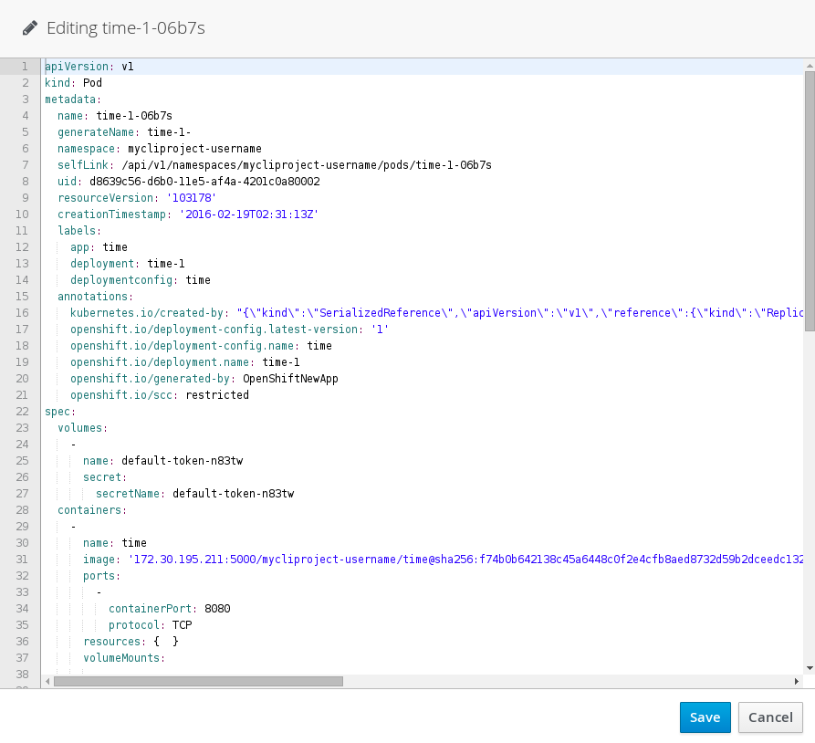
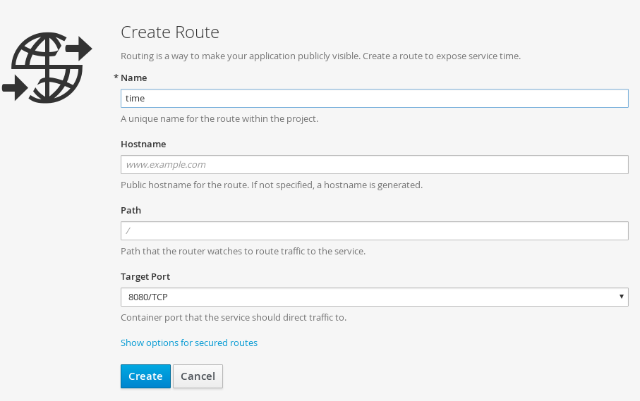

#**Lab 3: Web Console Basics**

In this lab exercise, we will review the OpenShift Web Console.

Type in the master public URL in a browser. Use <master public URL>:8443. You will be directed to an OpenShift login page. e.g.

    https://ose31-master.hosts.foo.com:8443

**Note**: Your browser may complain about the server's security certificates not trusted by your computer. You can agree to proceed to the master URL.

Key in the username and password from Lab.0. You will see the list of projects now. Note the project you created in the last lab exercise is shown here.

Also note the `New Project...` button which allows you to create a new project from Web Console and the Delete trashcan icon button that deletes a project and all its resources.

Now click on the CLI Project to view the details. OpenShift takes you by default to the `Overview` page and shows you a graphic representation of the application that is deployed here.

You can see that a single pod is running and is frontended by a service. Note the route that you configured for this service is also shown.

You will also see the `Add to Project` button on the right top. This can be used to create a new application from Web Console inside this project.

You can go back to the projects list page by clicking on `OPENSHIFT ENTERPRISE` on the top left of the screen.

Back in `Overview` Click on `Browse` button on the left and go through the list of items you can view there.

* On the Builds screen, you will see a list of previous builds. Select a build and you will see the details from build configuration. Note there are webhook URLs.

We will use them in a later lab exercise. You can start a build from the Web Console by pressing the `Build` button. It also gives you a command to start the build from CLI.

* On the Deployments screen, you will see a list of previous deployments. Select a deployment and you will see the details from deployment configuration.
You can start a deploy from the Web Console by pressing the `Deploy` button. It also gives you a command to start the deploy from CLI.

* On the Events screen, you can see all of the generated events for this particular project. You can also see these on the CLI using `oc get events`

* On the Image Streams screen, you can see a list of Docker Image Streams and their tags and update times. By selecting an image stream you will see the details for that docker image.
You can also see these on the CLI using `oc get is`

* On the Pods tab, you will find a list of pods. You will also see a build pod in the list view that had succeeded.
The running pod is the one running your application image - select it to see the details for that pod.
On the pod details page it tells you the node on which the pod is running.
You can also see and tail the Logs for that pod from the web console

We can also get a terminal shell for that running container straight from the web console. A similar command using CLI is `oc rsh <pod name>` if the pod has bash/sh

If Metrics are configured for your OpenShift cluster, a Metrics tab will be available for your pod:

You also have the ability to `Edit Raw` config files from within the User Interface - for example for a running pod select:

This will pop up a dialog for you to edit the pod definition. Editors are also available for other object types.

Back in Browse:

* On the Routes tab, you will see any DNS entries the services they route to. These are the externally visible ingress points for your clients to exposed services.
Select a route to see the details.

* On the Services tab, you will see cluster ip addresses, ports and protocols that exist for your applications.
If you select the service you can also use the `Create Route` screen link if your service has not been exposed already:

* On the Storage tab. you can see any Persistent Volume Claims that exist in your pod.

Click on the `Settings` button on the left to see that it would display the Quotas and Resource Limits, if they exist. We will deal with them in a different lab exercise.

Spend a few minutes and familiarize using Web Console
