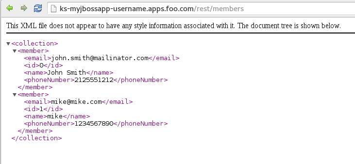

#**Lab 4: Create App using JBoss EAP Builder Image**

In this exercise we will learn how to create a JBoss EAP using source code and the JBoss EAP builder image.

**Step 1: Create a project or use an existing project**

If you want to, you can create a new project based on what you have learned in previous labs using the Web Console.

Or you can create a new project for JBoss Applications from the CLI:

**Remember** to replace the username before running the command.

    $ oc new-project myjbossapp-username --display-name="My JBoss Applications" --description="A place for my JBoss EAP Applications"

**Step 2: Create an application that uses the JBoss EAP builder image**

We will be using a sample application called "Kitchensink" (found [here](https://github.com/RedHatWorkshops/kitchensink) ).

Taking that source-code; we will use the JBoss ImageStream (or the builder image) to assemble our application.

Now create an application using the sample source-code found here https://github.com/RedHatWorkshops/kitchensink.

Run the `oc new-app` command by supplying the git uri as the parameter.

    $ oc new-app openshift/jboss-eap64-openshift:1.2~https://github.com/RedHatWorkshops/kitchensink --name=ks
    --> Found image c12d6b0 (7 weeks old) in image stream "jboss-eap64-openshift in project openshift" under tag :1.1 for "openshift/jboss-eap64-openshift:1.1"
        * A source build using source code from https://github.com/RedHatWorkshops/kitchensink will be created
          * The resulting image will be pushed to image stream "ks:latest"
        * This image will be deployed in deployment config "ks"
        * Ports 8080/tcp, 8443/tcp will be load balanced by service "ks"
    --> Creating resources with label app=ks ...
        ImageStream "ks" created
        BuildConfig "ks" created
        DeploymentConfig "ks" created
        Service "ks" created
    --> Success
        Build scheduled for "ks" - use the logs command to track its progress.
        Run 'oc status' to view your app.

Be aware that you can list all the image streams by running:

    oc get is -n openshift

**Step 3: Build**

Give it some time and you will see OpenShift starts the build process for you. You can view the list of builds using `oc get builds` command.

    $ oc get builds
    NAME      TYPE      FROM      STATUS    STARTED              DURATION
    ks-1      Source    Git       Running   About a minute ago   1m10s

Note the name of the build that is running i.e. ks-1. We will use that name to look at the build logs. Run the command as shown below to look at
the build logs. This will run for a few mins. At the end you will notice that the docker image is successfully created and it will start pushing
this to OpenShift's internal docker registry. You can can use the `-f` flag to tail the logs as well:

    $ oc build-logs ks-1 -f
    ....
    [INFO] Copying webapp resources [/home/jboss/source/src/main/webapp]
    [INFO] Webapp assembled in [30 msecs]
    [INFO] Building war: /home/jboss/source/deployments/ROOT.war
    [INFO] ------------------------------------------------------------------------
    [INFO] BUILD SUCCESS
    [INFO] ------------------------------------------------------------------------
    [INFO] Total time: 2:22.725s
    [INFO] Finished at: Wed Nov 18 15:40:29 EST 2015
    [INFO] Final Memory: 18M/54M
    [INFO] ------------------------------------------------------------------------
    Copying all WAR and EAR artifacts from /home/jboss/source/target directory into /opt/eap/standalone/deployments for later deployment...
    Copying all WAR and EAR artifacts from /home/jboss/source/deployments directory into /opt/eap/standalone/deployments for later deployment...
    '/home/jboss/source/deployments/ROOT.war' -> '/opt/eap/standalone/deployments/ROOT.war'
    I1118 15:40:29.584701       1 docker.go:463] Container wait returns with 0 and <nil>
    I1118 15:40:29.584725       1 docker.go:470] Container exited
    I1118 15:40:29.584731       1 docker.go:552] Invoking postExecution function
    I1118 15:40:29.584749       1 sti.go:262] No .sti/environment provided (no environment file found in application sources)
    I1118 15:40:29.587289       1 docker.go:586] Committing container with config: {Hostname: Domainname: User: Memory:0 MemorySwap:0 CPUShares:0 CPUSet: AttachStdin:false AttachStdout:false AttachStderr:false PortSpecs:[] ExposedPorts:map[] Tty:false OpenStdin:false StdinOnce:false Env:[OPENSHIFT_BUILD_NAMESPACE=wk1 OPENSHIFT_BUILD_SOURCE=https://github.com/RedHatWorkshops/kitchensink OPENSHIFT_BUILD_NAME=ks-1] Cmd:[/usr/local/s2i/run] DNS:[] Image: Volumes:map[] VolumeDriver: VolumesFrom: WorkingDir: MacAddress: Entrypoint:[] NetworkDisabled:false SecurityOpts:[] OnBuild:[] Mounts:[] Labels:map[io.openshift.tags:builder,javaee,eap,eap6 Version:1.1 io.openshift.build.commit.ref:master io.openshift.build.commit.author:Christian Hernandez <christianh814@users.noreply.github.com> Build_Host:rcm-img-docker01.build.eng.bos.redhat.com io.openshift.build.commit.message:updated the README.md file Architecture:x86_64 io.k8s.display-name:172.30.234.236:5000/wk1/ks:latest Authoritative_Registry:registry.access.redhat.com BZComponent:jboss-eap-6-eap64-openshift-docker Name:jboss-eap-6/eap64-openshift io.openshift.expose-services:8080:http io.openshift.build.commit.id:ebce78d0852365a9d2709b8a4f0547d2c6c84f93 io.openshift.build.image:registry.access.redhat.com/jboss-eap-6/eap64-openshift:1.1 Vendor:Red Hat, Inc. org.jboss.deployments-dir:/opt/eap/standalone/deployments Release:2 io.k8s.description:Platform for building and running JavaEE applications on JBoss EAP 6.4 io.openshift.build.commit.date:Mon Oct 12 14:26:54 2015 -0700 io.openshift.build.source-location:https://github.com/RedHatWorkshops/kitchensink io.openshift.s2i.scripts-url:image:///usr/local/s2i]}
    I1118 15:40:32.358284       1 sti.go:298] Successfully built 172.30.234.236:5000/wk1/ks:latest
    I1118 15:40:36.796168       1 cleanup.go:23] Removing temporary directory /tmp/s2i-build616820634
    I1118 15:40:36.796198       1 fs.go:99] Removing directory '/tmp/s2i-build616820634'
    I1118 15:40:36.799258       1 sti.go:213] Using provided push secret for pushing 172.30.234.236:5000/wk1/ks:latest image
    I1118 15:40:36.799282       1 sti.go:217] Pushing 172.30.234.236:5000/wk1/ks:latest image ...
    I1118 15:41:09.552049       1 sti.go:233] Successfully pushed 172.30.234.236:5000/wk1/ks:latest

You will notice that in the logs that not only does it copy your source code to the builder image, but it also does a `maven` build to compile your code as well.

Also, in the above log, note how the image is pushed to the local docker registry. The registry is running at 172.30.234.236 at port 5000.

**Step 4: Deployment**

Once the image is pushed to the docker registry, OpenShift will trigger a deploy process. Let us also quickly look at the deployment configuration
by running the following command. Note dc represents deploymentconfig.

    $ oc get dc ks -o json
    {
        "kind": "DeploymentConfig",
        "apiVersion": "v1",
        "metadata": {
            "name": "ks",
            "namespace": "wk1",
            "selfLink": "/oapi/v1/namespaces/wk1/deploymentconfigs/ks",
            "uid": "3fd34c91-8e34-11e5-ad77-525400b36d1d",
            "resourceVersion": "132011",
            "creationTimestamp": "2015-11-18T20:37:56Z",
            "labels": {
                "app": "ks"
            },
            "annotations": {
                "openshift.io/generated-by": "OpenShiftNewApp"
            }
        },
        "spec": {
            "strategy": {
                "type": "Rolling",
                "rollingParams": {
                    "updatePeriodSeconds": 1,
                    "intervalSeconds": 1,
                    "timeoutSeconds": 600,
                    "maxUnavailable": "25%",
                    "maxSurge": "25%"
                },
                "resources": {}
            },
            "triggers": [
                {
                    "type": "ConfigChange"
                },
                {
                    "type": "ImageChange",
                    "imageChangeParams": {
                        "automatic": true,
                        "containerNames": [
                            "ks"
                        ],
                        "from": {
                            "kind": "ImageStreamTag",
                            "name": "ks:latest"
                        },
                        "lastTriggeredImage": "172.30.234.236:5000/wk1/ks@sha256:40f3d39dee6aa933e020e6e4b0f91f6c7ed1ff57241040eb730bb24b9e9ed16f"
                    }
                }
            ],
            "replicas": 1,
            "selector": {
                "app": "ks",
                "deploymentconfig": "ks"
            },
            "template": {
                "metadata": {
                    "creationTimestamp": null,
                    "labels": {
                        "app": "ks",
                        "deploymentconfig": "ks"
                    },
                    "annotations": {
                        "openshift.io/generated-by": "OpenShiftNewApp"
                    }
                },
                "spec": {
                    "containers": [
                        {
                            "name": "ks",
                            "image": "172.30.234.236:5000/wk1/ks@sha256:40f3d39dee6aa933e020e6e4b0f91f6c7ed1ff57241040eb730bb24b9e9ed16f",
                            "ports": [
                                {
                                    "containerPort": 8080,
                                    "protocol": "TCP"
                                },
                                {
                                    "containerPort": 8443,
                                    "protocol": "TCP"
                                }
                            ],
                            "resources": {},
                            "terminationMessagePath": "/dev/termination-log",
                            "imagePullPolicy": "Always"
                        }
                    ],
                    "restartPolicy": "Always",
                    "terminationGracePeriodSeconds": 30,
                    "dnsPolicy": "ClusterFirst",
                    "securityContext": {}
                }
            }
        },
        "status": {
            "latestVersion": 1,
            "details": {
                "causes": [
                    {
                        "type": "ImageChange",
                        "imageTrigger": {
                            "from": {
                                "kind": "DockerImage",
                                "name": "172.30.234.236:5000/wk1/ks:latest"
                            }
                        }
                    }
                ]
            }
        }
    }

Note where the image is picked from. It shows that the deployment picks the image from the local registry (same ipaddress and port as in buildconfig)
and the image tag is the same as what we built earlier. This means the deployment step deploys the application image that was built earlier during the build step.

If you get the list of pods, you'll notice that the application gets deployed quickly and starts running in its own pod.

    $ oc get pods
    NAME         READY     STATUS      RESTARTS   AGE
    ks-1-a86xv   1/1       Running     0          2m
    ks-1-build   0/1       Completed   0          5m

**Step 5: Adding route**

This step is very much the same as what we did in previous exercises. We will check the service and add a route to expose that service. 

    $ oc get service ks
    NAME      CLUSTER_IP      EXTERNAL_IP   PORT(S)             SELECTOR                     AGE
    ks        172.30.46.136   <none>        8080/TCP,8443/TCP   app=ks,deploymentconfig=ks   6m

    $ oc expose service ks
    route "ks" exposed

    $ oc get routes
    NAME      HOST/PORT             PATH      SERVICE   LABELS    INSECURE POLICY   TLS TERMINATION
    ks        ks-myjbossapp-username.apps.foo.com             ks        app=ks

**Step 6: Run the application**

Now run the application by using the route you provided in the previous step. Use either curl and then your browser.

Try adding a new user into the application and browse the data using the REST web services exposed.

    $ curl ks-myjbossapp-username.apps.foo.com
    <!-- Plain HTML page that kicks us into the app -->
    <html>
    <head>
    <meta http-equiv="Refresh" content="0; URL=index.jsf">
    </head>
    </html>

**Optional Extras**

The EAP image supports incremental builds to help speed up maven dependency resolution.
When the `incremental` flag in the BuildConfig is true, the EAP image will pull the maven artifacts out of the previous version
of the application image rather than re-downloading them.

[Documentation](https://docs.openshift.com/enterprise/3.1/dev_guide/builds.html#incremental-builds) is here and
[Here](https://blog.openshift.com/improving-build-time-java-builds-openshift/) for java builds generally (using a Nexus server)

In this example, we can run:

    $ oc get bc/ks -o yaml | sed -e 's/namespace: openshift$/namespace: openshift\n\ \ \ \ \ \ incremental: true/' | oc replace -f -

When you start a new build, the time to build should be markedly improved.

**Congratulations!** In this exercise you have learned how to create, build and deploy a JBoss EAP application using OpenShift's JBoss EAP Builder Image.

