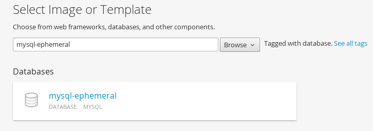
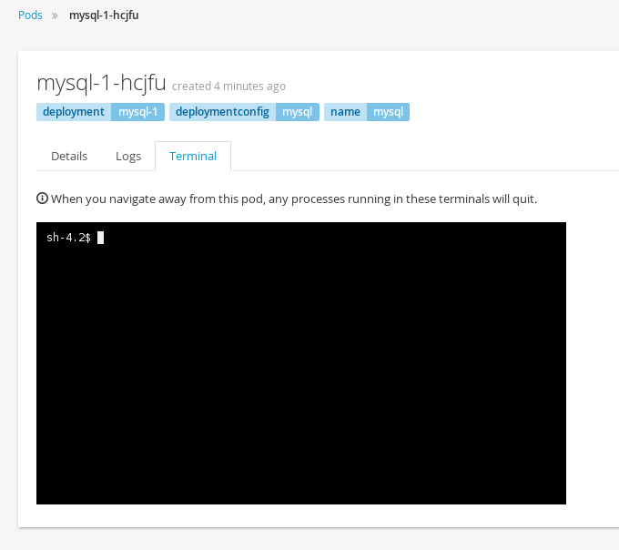
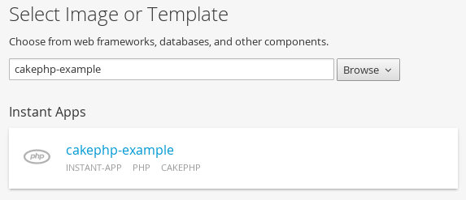
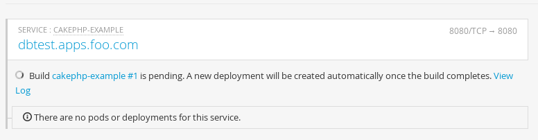

#**Lab 5: Create App using Templates**

In this lab exercise we will learn to use OpenShift Web Console to spin up a MySQL database using templates.

We will then add a frontend PHP application that accesses this database using the service exposed by the database.

We will provide a route (a URL) to access the frontend application from a browser.

**Step 1: Create a Project**

Based on the experience gained from the previous exercise, log into the OpenShift Web Console.
You will see the list of Projects.

Using the `New Project` Button, create a new project. I am going to call it `consoleproject-username`

Substitute your username to make this project unique. Type in a `Display Name` and `Description` of your choice.

Press the `Create` button to complete the project creation from the Web Console. This will accomplish the same job as
`oc create project` from CLI

**Step 2: Create a MYSQL database using the template**

You will be taken to the Select Image or Template page straight away.

  
You can use the `Browse` drop down `Database` or `Filter` to select the `mysql-ephemeral` template from the list.

You will also notice 'mysql-persistent' template. But we will address that in a different lab exercise.

You will be taken to the mysql ephemeral creation screen. Click edit parameters and edit the values. I am using the values as

* Database Service Name: mysql
* MySQL User: mysqluser
* MySQL Password: supersecret
* MySQL Database: sample

In the next section you can `add` labels

* name=name
* value=mysql

Click the `Create` button.

You will then be taken back to the project details page and soon you will see an image of a running pod.

Browse over to Pods, Services and Deployments to notice the additions to the project. You will note that the service has been assigned
an IP address that starts with 172.*. Make a note of that. Also note the port that is exposed by this service. By default it exposes 3306.

**Step 3: Add data to MySQL database**

The quickest way to enter the database pod is to browse to `Pods`, select the mysql pod and enter the terminal:

We can enter the pod and access the database using the CLI.

From the command line, change the project to the "consoleproject-UserName" using command
**Remember** to substitute your username

    oc project consoleproject-username

Based on what you learnt previously get the list of running pods (Tip: `oc get pods`). You will find one pod for mysql running. Note its name.

Enter the pod by running the following command. Substitute the podname with your mysql pod name.

    $ oc rsh mysql-1-aewve
    bash-4.2$

You will be taken to a bash prompt inside the running pod. Now using the service ip address you noted earlier, port number, username and password
you used start the mysql client as shown below. You will have to substitute your values here.
 
*Tip:* If you need service ip address navigate to `Browse->Services` tab on the Web Console. 

    mysql -h172.30.58.24 -P3306 -umysqluser -psupersecret

You will be taken to the `mysql` prompt. See the list of databases. You will notice that the sample database that you requested is added and available.

    show databases;

Change over to use the `sample` database.

    use sample;

Now `show tables` shows an empty set. So let us create a table and add some records using the commands shown below.

    create table users (user_id int not null auto_increment, username varchar(200),PRIMARY KEY(user_id));

    insert into users values (null, 'joe');
    insert into users values (null, 'alice');

Verify that the records you added are there 

    select * from users;

Now `exit` MySQL client and `exit` out of the pod.

**Step 4: Add a PHP frontend to talk to this database**

In this step we will add a PHP frontend application that talks to recently create database. The code is available on github to use at

    https://github.com/eformat/dbtest

Browse through the code in this repository. It has a simple php file `dbtest.php` that connects to the database and reads the values from the users table and displays them.

To add a frontend again press on `Add to Project` to spin up a frontend application in the same 'consoleproject'.

Just like before navigate to the templates area and choose the **cakephp-example** template.

You will be taken to the screen where you can edit the template defaults like before. Click on `edit parameters` link and change the following values:

* Source control repository URL: https://github.com/eformat/dbtest.git
* Application domain name: dbtest.username.apps.foo.com **Remember** to substitute username
* Database Service Name: mysql (this should match the service name for database created earlier)
* Database Engine: mysql
* Database Name: sample
* Database User: mysqluser (the value we set earlier)
* Database Password: supersecret (the value we set earlier)

In the next section `add` labels

* name=name
* value=dbtest

Click `Create` to add this frontend application to talk to the database.

You will be taken back to the Overview Page. Select Project Details page and you will start seeing that a build has started and a service has been made available. It
may take a short time to start.

Once the build completes, the application image created from the source code will be uploaded to the docker repository. You can check the build logs using the
web console or from the CLI using the following command.

    $ oc logs build/cakephp-example-1 -f

Once the build completes, OpenShift initiates a deploy process. Once the deployment is complete, the frontend pod starts running.
You will find the running pod when you navigate to `Browse->Pods` on the Web console.

Now type in your application url in the browser or use curl with

    http://<<your application url>>/dbtest.php

You will notice that it displays the records read from the database

    Here is the list of users:
    User Id: 1 User Name: joe
    User Id: 2 User Name: alice
    End of the list

**Some extra commands to try out**

The php image supports *Hot Deploy*. You can enter into the php pod by using this command (or the terminal in the web console)

    $ oc rsh <pod name>

You will land in the php src directory and you can edit the files directly in the pod:

    $ oc rsh cakephp-example-1-zz0ht
    bash-4.2$ pwd
    /opt/app-root/src

    bash-4.2$ vi index.php

    Welcome to OpenShift Version 3.1 !!

    Try /dbtest.php webpage :-)

Refresh the web page and you should see your changes.

You can also try out the [`rsync`](https://docs.openshift.org/latest/cli_reference/basic_cli_operations.html#troubleshooting-and-debugging-cli-operations) command.

This syncs files between you pod and local machine.

    $ mkdir php; cd php

    $ oc rsync cakephp-example-1-zz0ht:/opt/app-root/src .
    receiving incremental file list
    src/
    src/.bash_history
    src/dbtest.php
    src/index.php

    sent 72 bytes  received 1,034 bytes  737.33 bytes/sec
    total size is 778  speedup is 0.70

Edit your files locally, then sync them back to the pod.

    $ cd php/src

    $ oc rsync . cakephp-example-1-zz0ht:/opt/app-root/src

    sending incremental file list
    .bash_history
    index.php

    sent 299 bytes  received 65 bytes  242.67 bytes/sec
    total size is 787  speedup is 2.16

These are great for debugging purposes - but remember images are immutable ! your changes are quickly lost when the container is restarted.

##Summary##

In this lab exercise you have seen a complete web application deployed using OpenShift templates in two parts.

First we deployed the MySQL database. We added data manually by getting into the pod.

Then we added the frontend code that was built using the OpenShift S2I process.

You configured this frontend application to access the database using a service, in this case, the "mysql" service.

The frontend is made accessible using a route for which you gave a URL.
