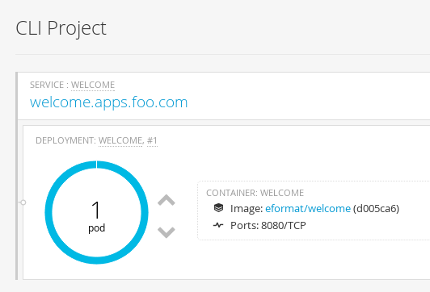
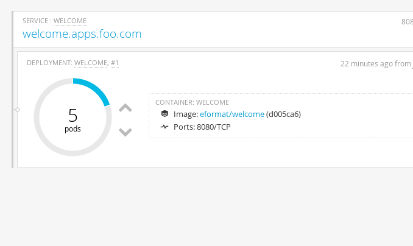

#**Lab 6: Scaling Applications**

In this exercise we will learn how to scale our application.

OpenShift has the capability to scale your application and make sure that many instances are always running.

**Step 1: Switch to an existing project**

For this exercise, we will be using an already running application.

We will be using the Welcome app - `mycliproject-username` that you created in lab 1. Quickly recreate it now if the resources don't exist.

Make sure you are switched to that project by using the `oc project` command. **Remember** to substitute username

    $ oc project mycliproject-username

**Step 2: View the deployment config**

Take a look at the `deploymentConfig` (or the `dc` shorthand) of the `welcome` application

    $ oc get dc/welcome -o yaml
    apiVersion: v1
    kind: DeploymentConfig
    metadata:
      annotations:
        openshift.io/generated-by: OpenShiftNewApp
      creationTimestamp: 2015-11-18T22:22:41Z
      labels:
        app: welcome
      name: welcome
      namespace: wk1
      resourceVersion: "134440"
      selfLink: /oapi/v1/namespaces/wk1/deploymentconfigs/welcome
      uid: e1baa01e-8e42-11e5-ad77-525400b36d1d
    spec:
      replicas: 1
      selector:
        app: welcome
        deploymentconfig: welcome
      strategy:
        resources: {}
        rollingParams:
          intervalSeconds: 1
          maxSurge: 25%
          maxUnavailable: 25%
          timeoutSeconds: 600
          updatePeriodSeconds: 1
        type: Rolling
      template:
        metadata:
          annotations:
            openshift.io/generated-by: OpenShiftNewApp
          creationTimestamp: null
          labels:
            app: welcome
            deploymentconfig: welcome
        spec:
          containers:
          - image: eformat/welcome@sha256:d005ca66b3c842aeedbe6ef150845a13ed155627ab06b147d852b6b889bbd908
            imagePullPolicy: IfNotPresent
            name: welcome
            ports:
            - containerPort: 8080
              protocol: TCP
            resources: {}
            terminationMessagePath: /dev/termination-log
          dnsPolicy: ClusterFirst
          restartPolicy: Always
          securityContext: {}
          terminationGracePeriodSeconds: 30
      triggers:
      - type: ConfigChange
      - imageChangeParams:
          automatic: true
          containerNames:
          - welcome
          from:
            kind: ImageStreamTag
            name: welcome:latest
          lastTriggeredImage: eformat/welcome@sha256:d005ca66b3c842aeedbe6ef150845a13ed155627ab06b147d852b6b889bbd908
        type: ImageChange
    status:
      details:
        causes:
        - imageTrigger:
            from:
              kind: DockerImage
              name: eformat/welcome:latest
          type: ImageChange
      latestVersion: 1

Note that the spec: `replicas:` is set to `1`. This tells OpenShift that when this application deploys, make sure that there is 1 instance in the web console:

The `replicationController` mirrors this configuration initially; the `replicationController` (or `rc`) will ensure that there is always the set number of instances always running.

To view the `rc` for your application first get the current pod running

    $ oc get pods
    NAME              READY     STATUS    RESTARTS   AGE
    welcome-1-vekeb   1/1       Running   0          5m

The replication controller shows that the build `welcome-1` is running in pod `vekeb`. Let us view the `rc` on this build

    $ oc get rc/welcome-1
    CONTROLLER   CONTAINER(S)   IMAGE(S)                                                                                  SELECTOR                                                    REPLICAS   AGE
    welcome-1    welcome        eformat/welcome@sha256:d005ca66b3c842aeedbe6ef150845a13ed155627ab06b147d852b6b889bbd908   app=welcome,deployment=welcome-1,deploymentconfig=welcome   1          6m

**Note:** You can change the number of replicas in DeploymentConfig or the ReplicationController.

However note that if you change the `deploymentConfig` it applies to your application. This means, even if you delete the current replication controller,
the new one that gets created will be assigned the REPLICAS value based on what is set for DC.

If you change it on the Replication Controller, the application will scale up. But if you happen to delete the current
replication controller for some reason, you will loose that setting.

**Step 3: Scale Application**

Of course the easiest way to scale your application is by using the `Up` and `Down` arrows from the Pod page in the web console:

Now scale your application using the CLI `oc scale` command (remembering to specify the `dc`)

    $ oc scale --replicas=3 dc/welcome

Go back to your web console and you will see that there are 3 instances running now

On the command line, see how many pods you are running now

    $ oc get pods
    NAME              READY     STATUS    RESTARTS   AGE
    welcome-1-7wfv9   1/1       Running   0          36s
    welcome-1-hn4s3   1/1       Running   0          36s
    welcome-1-ozh0p   1/1       Running   0          2m

You now have 3 instances of `welcome-1` running (each with a different pod-id)

If you check the `rc` of the `welcome-1` build you will see that it has been updated by the `dc`.

    $ oc get rc/welcome-1
    CONTROLLER   CONTAINER(S)   IMAGE(S)                                                                                  SELECTOR                                                    REPLICAS   AGE
    welcome-1    welcome        eformat/welcome@sha256:d005ca66b3c842aeedbe6ef150845a13ed155627ab06b147d852b6b889bbd908   app=welcome,deployment=welcome-1,deploymentconfig=welcome   3          27m

**Step 4: Scaling Down**

Scaling down is the same procedure as scaling up. Use the `oc scale` command on the time `dc` setting.

    $ oc scale --replicas=1 dc/welcome

**Congratulations!!** In this exercise you have learned about scaling and how to scale up/down your application on OpenShift!
