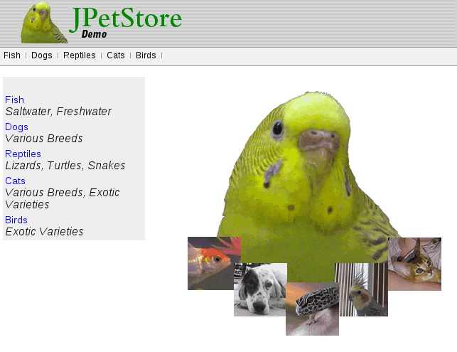

#**Lab 7: Binary Java WAR file deployment**

In the past you have seen how OpenShift can take your existing java code, build it and deploy the resultant docker image as an application.

OpenShift S2I process includes an assemble script that copies the source code from a git repository, invokes a maven build, places the resultant
war file in the deployments folder, builds a new application image and pushes that image into the registry.

But how about if you want OpenShift to deploy a war file that you built yourself?

In this exercise you will learn to deploy a war file. We will assume that you built your source code outside of OpenShift build process and
checked in a war file into a repository, perhaps your artifact repo.

OpenShift allows you to customize the assemble script. For this lab, we customized this assemble script to pull the war file from a location
of your choice by supplying a `WAR_FILE_URL`.

As long as the builder pod has access to pull it from this location it will pull the war file, place it in the deployments folder and build the application image.

In this lab, we will use the `petstore` application war file as an example.

Look at the customization to the assemble script for EWS [here](https://github.com/eformat/ews-bin-deploy/tree/master/.sti/bin)

    https://github.com/eformat/ews-bin-deploy/tree/master/.sti/bin

    line 66: curl -o ${DEPLOY_DIR}/ROOT.war -O ${WAR_FILE_URL}

We added the `curl` command above which copies the code to the deployment directory. This customized assemble script is placed in a .sti/bin folder in the git repository.

Since you don't have any source code to deploy we will create an application using this empty repository that just has this customized script.

**Step 1: Create a new project**

Create a new project based on what you learnt in the earlier exercises. Name the project "bindep-username" (substitute username),
display name "Binary Deployment" and description "My project to test Binary Deployment".

**Step 2: Add an environment variable WAR_LOCATION**

    export WAR_LOCATION=https://raw.githubusercontent.com/eformat/ps/master/deployments/ROOT.war

You can `echo $WAR_LOCATION` to confirm that the variable is set to appropriate value. The URL here points to petstore war file. This can be any working war file.

Windows users will need to perform a slightly different command here - see below.

**Step 3: Deploy a JBossEWS application using the customized repository**

Windows users keep reading. The command below may not work for you (carriage return and space characters)

    $ oc new-app jboss-webserver30-tomcat8-openshift~https://github.com/eformat/ews-bin-deploy.git --name=petstore -o yaml | sed -e "/sourceStrategy/a \\
    \ \ \ \ \ \ \ \ env:\\
    \ \ \ \ \ \ \ \ - name: WAR_FILE_URL\\
    \ \ \ \ \ \ \ \ \ \ value: $WAR_LOCATION" | oc create -f -

Copy paste the above command.

We are doing a few things in the above command to condense the number of steps. We cover them in more details below:
 
1. We are running a command that can create an application using `jboss-webserver30-tomcat8-openshift` imagestream
2. This application will be created based on the git repository that holds the custom assemble script `https://github.com/eformat/ews-bin-deploy.git`
3. The name of this application will be `petstore`
4. `-o yaml` will produce a yaml output for the command we are running. So instead of creating an application directly we are interested in the yaml output of this new-app command
5. We want to edit this yaml output to add a variable to the buildConfig. The `sed` command will add an environment variable WAR_FILE_URL and set its value to based on the
 `WAR_LOCATION` variable we created in the previous step. Note that it adds the required number of leading spaces on each line (this is very important in a yaml).
6. The output after the edits is being passed into `oc create -f -` command that will create the application based on the input piped to it.

If you are interested in step by step approach of how this is done, please refer this blog (https://blog.openshift.com/binary-deployments-openshift-3/).

Within a few minutes you will see that the application named petstore will be built and deployed.

Windows users may have challenge with the above step as 'sed' may not be available on their box. So use the following instead:

Create the application

    $ oc new-app jboss-webserver30-tomcat8-openshift~https://github.com/eformat/ews-bin-deploy.git --name=petstore

Edit build configuration manually.

    $ oc edit bc -o json

This will open up your build configuration. Find the sourceStrategy section and add the environment variable. Your sourceStrategy section should look as shown below.
Here you can replace the .war file URL with your own if you want to deploy your application instead of petstore.

Note: Be careful about closing the braces and don’t forget to add a comma at the end of the from section.

    "sourceStrategy": {
       "from": {
          "kind": "ImageStreamTag",
          "namespace": "openshift",
          "name": "jboss-webserver30-tomcat8-openshift:latest"
           },
          "env": [
              {
                "name": "WAR_FILE_URL",
                 "value": "https://raw.githubusercontent.com/eformat/ps/master/deployments/ROOT.war"
              }
          ]
    }

Once the build configuration is changed start a new build. A build may have already run once. Ignore that previous build.

    $ oc start-build petstore
    petstore-2

**Step 4: Create a route**

The previous step would have created a service with name `petstore`. Confirm by running the following command.

    $ oc get service

Now let us create a route by exposing this service. Substitute the username and domain name given to you remove angle brackets (< >) 

    $ oc expose service petstore --hostname=petstore.<username>.<domainname>

**Step 5: Run the application**

Confirm that your application pod is running.

**Tip:** `oc get pods` and watch out for a pod with a name like petstore-1-xyzb. You should see a build pod (such as petstore-1-build)
that is complete with Exit Code:0. If the application is still getting deployed a deployer pod (example petstore-1-deploy) might be still running.

Invoke your application URL in the browser and you should see the all time favorite petstore application. You can initialize the database and start shopping your favorite pets.

**Congratulations!** In this lab exercise you have learnt how to deploy a war file as an application in OpenShift.
