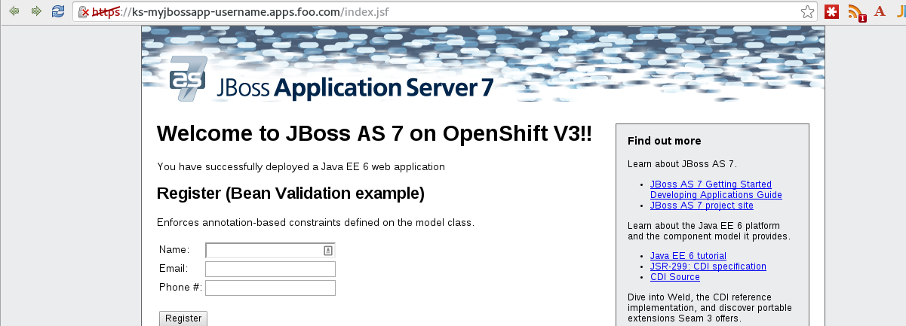

#**Lab 8: Using SSL in your Application**

In this exercise you will set up your application to encrypt traffic with the OpenShift Wildcard certificate

**Step 1: Switch to an existing project**

For this exercise, we will be using an already running application. We will be using the `myjbossapp-username` that you created in the previous labs.
Make sure you are switched to that project by using the `oc project` command. **Remember** to substitute UserName

    $ oc project myjbossapp-username

**Step 2: View the routing config**

To view the routing config you will need to use the `oc get route` command

    $ oc get route/ks -o yaml
    apiVersion: v1
    kind: Route
    metadata:
      annotations:
        openshift.io/host.generated: "true"
      creationTimestamp: 2015-11-19T01:18:05Z
      labels:
        app: ks
      name: ks
      namespace: myjbossapp-username
      resourceVersion: "138234"
      selfLink: /oapi/v1/namespaces/myjbossapp-username/routes/ks
      uid: 62daca7c-8e5b-11e5-a2d1-525400b36d1d
    spec:
      host: ks-myjbossapp-username.apps.foo.com
      port:
        targetPort: "8080"
      to:
        kind: Service
        name: ks
    status: {}

Note here that the `host:` is set to the FQDN that your application is running on.

Currently the routing component of OpenShift 3 supports ports 80 and 443. When you first create your route, the mapping of 80 to your pod is done automatically.
There are a few things that need to be done in order to get the 443 mapping to work.

**Step 3: TLS Edge Termination**

OpenShift has a "wildcard" SSL certificate that it can use for any application. We can use this SSL certificate to serve SSL from our application without having
to generate a cert of our own (which is sometimes called SSL-offloading).

Edit your routing configuration

    $ oc edit route/ks -o yaml

You are going to add `tls: termination: edge` right below the `host:` section. It should look something like this.

    apiVersion: v1
    kind: Route
    metadata:
      annotations:
        openshift.io/host.generated: "true"
      creationTimestamp: 2015-11-19T01:18:05Z
      labels:
        app: ks
      name: ks
      namespace: myjbossapp-username
      resourceVersion: "138234"
      selfLink: /oapi/v1/namespaces/myjbossapp-username/routes/ks
      uid: 62daca7c-8e5b-11e5-a2d1-525400b36d1d
    spec:
      host: ks-myjbossapp-username.apps.foo.com
      tls:
        termination: edge
      port:
        targetPort: "8080"
      to:
        kind: Service
        name: ks
    status: {}

**Step 4: Verify**

Verify by visiting your page by using the `https://` URI

You can also see this successfully added to the route by running

    $ oc get route
    NAME      HOST/PORT                             PATH      SERVICE   LABELS    INSECURE POLICY   TLS TERMINATION
    ks        ks-myjbossapp-username.apps.foo.com             ks        app=ks                      edge

**Further reading**

Other types of SSL termination such as pass-through (traffic is sent straight through to the container) and re-encryption are
also possible and are documented [here](https://docs.openshift.com/enterprise/3.1/architecture/core_concepts/routes.html#secured-routes)

**Congratulations!** In this exercise you have learned about service SSL from your application
