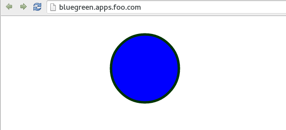
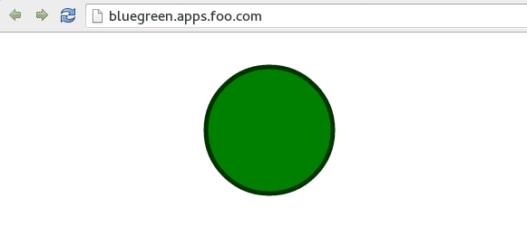

#**Lab 9: Blue/Green Deployments**

The purpose of this short lab is to demonstrate how simple it is to implement Blue-Green Deployments in OpenShift v3.

`Blue-Green` deployment is a release strategy that can be utilized by developers for deploying software in a production environment.

Blue can be one particular production environment whereas green can define an identical production environment.

Under blue-green deployment strategy, software developers are able to minimize downtime and reduce [risk](https://en.wikipedia.org/wiki/User:Nuqing/Blue-green_deployment)

In this Lab, we will be:

1. Deploying two versions of the same application. The first version will display a blue circle.
2. Create a FQDN that can be used to expose the applications.
3. We will first expose the first application.
4. We will also create another version of this application in the same project that displays a green circle.
5. We will then switch the FQDN to from the first application (blue) to the second application (green)

## Part I

**Step 1: Create a new project**

**Remember** to substitute the username

    $ oc new-project bluegreen-username --display-name="Blue Green Project" --description="Blue Green Project"

**Step 2: List existing image builder or image streams**

    $ oc new-app -S --image=nodejs

**Step 3: Create an application**

We will be using a sample application that displays a blue or green circle.

The sample app can be browsed in

    https://github.com/eformat/bluegreen.git

The file where the one-line colour change is performed is here:

    https://github.com/eformat/bluegreen/blob/master/requestHandlers.js

There are two branches, each with different color settings:

    master: blue
    green: green

Lets create the blue application first

    $ oc new-app --image-stream=nodejs --code=https://github.com/eformat/bluegreen.git#master --name=blue

**Step 4: Monitor the application build**

    $ oc get builds

Using the build name of the recently created application run:

    $ oc logs build/"your-build-name"

Once the build finishes you should see something similar to:

    I1118 20:46:36.836415       1 sti.go:233] Successfully pushed 172.30.234.236:5000/bluegreen-username/blue:latest

**Step 5: Check application deployment status**

    $ oc get pods
    NAME           READY     STATUS      RESTARTS   AGE
    blue-1-arg0g   1/1       Running     0          59s
    blue-1-build   0/1       Completed   0          1m

Notice that the build pod has exited and you now have a single instance of the application running under one single pod.

**Step 6: List the service**

    $ oc get svc

**Step 7: Create a route for the application**

**Remember** to substitute the username

    $ oc expose service blue --hostname=bluegreen.username.apps.osecloud.com --name=bluegreen

**Step 8: Test the application**

    $ oc get route

Copy the HOST/PORT and paste it in your browser. You should see something similar to:

At this point you have deployed an application that displays for illustration purposes a blue circle for version 1.

## Part II

In this part, we will:

1. Deploy a new version of this application (Same one as before with a very small change)
2. Point the previously created FQDN (route) to the new service that will be created as part of the new application creation process.

**Step 1: Deploy the new version of the application**

Ensure you have done steps 3 through 6 from Part I.

Lets deploy a new version of the the application named green and use the branch `green` this time.

    $ oc new-app --image-stream=nodejs --code=https://github.com/eformat/bluegreen.git#green --name=green

Wait until the application is built and deployed. You should now see two services if you run:

    $ oc get service
    NAME      CLUSTER_IP      EXTERNAL_IP   PORT(S)    SELECTOR                           AGE
    blue      172.30.42.122   <none>        8080/TCP   app=blue,deploymentconfig=blue     7m
    green     172.30.11.104   <none>        8080/TCP   app=green,deploymentconfig=green   42s

Edit the previously created route and change the service name, all the way at the bottom, to the new service that was just created.

You are essentially still using the FQDN you had previously created. However, that route will now point to a different service.

    $ oc edit route bluegreen
    apiVersion: v1
    kind: Route
    metadata:
      creationTimestamp: 2015-11-19T01:48:50Z
      labels:
        app: blue
      name: bluegreen
      namespace: bluegreen-username
      resourceVersion: "139013"
      selfLink: /oapi/v1/namespaces/bluegreen-username/routes/bluegreen
      uid: ae633249-8e5f-11e5-a2d1-525400b36d1d
    spec:
      host: bluegreen.apps.foo.com
      port:
        targetPort: "8080"
      to:
        kind: Service
        name: blue
    status: {}

You should see the route change in the web console and from the CLI if you `oc get route`

**Step 2: Test the application**

    $ oc get route

Copy the HOST/PORT and paste it in your browser.

You should now see the new version of the recently deployed application.

**Step 3: HowTo quickly change routes**

To easily switch the route between blue and green services, you can use `oc replace` and sed in a one-liner as follows:

Switch services to green

    $ oc get route/bluegreen -o yaml | sed -e 's/name: blue$/name: green/' | oc replace -f -

And back to blue again

    $ oc get route/bluegreen -o yaml | sed -e 's/name: green$/name: blue/' | oc replace -f -

## Summary

Blue-Green deployments can be easily accomplished in OpenShift v3.

We have shown multiple versions of an application; all running concurrently, each with a unique service.

All that is needed to expose any of the applications is to change the service being used by the route to publicly advertise the application.